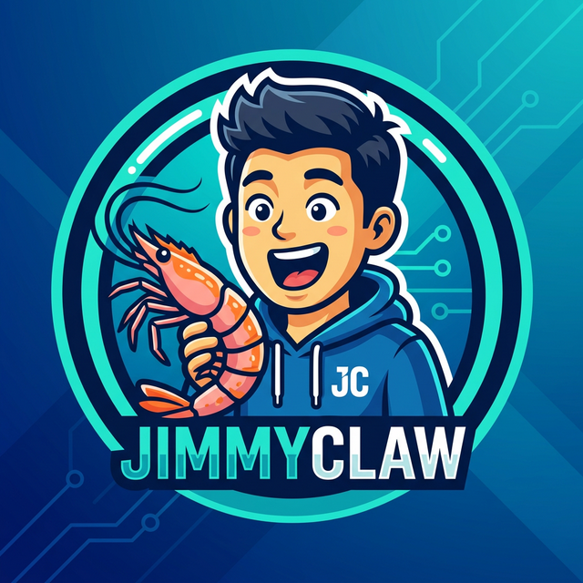
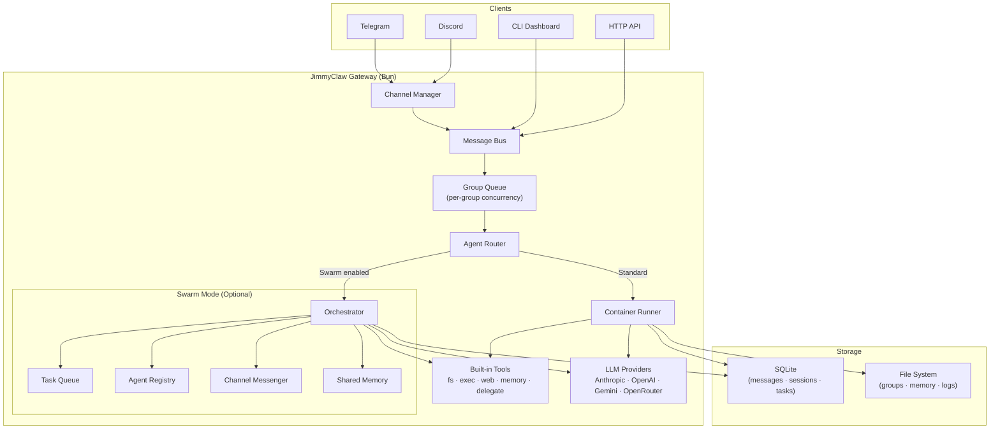
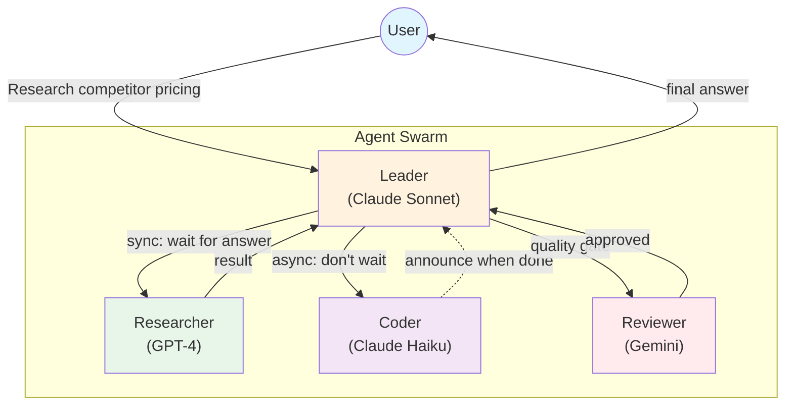
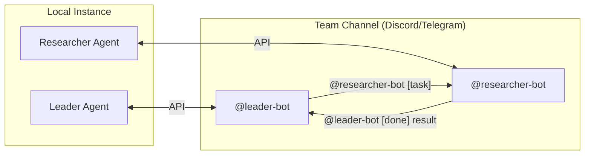
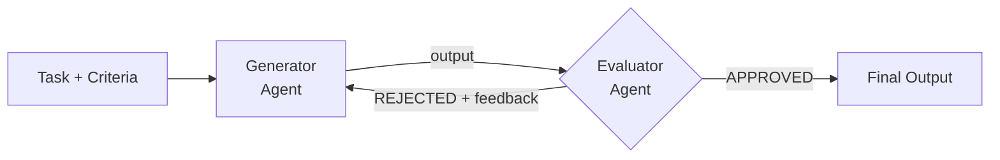

<p align="center">
  
</p>

<p align="center">
  <strong>JimmyClaw</strong> — A TypeScript/Bun multi-agent AI gateway with container isolation, agent swarms, and programmable skill system.
</p>

<p align="center">
  <a href="https://jimmyclaw.dev">jimmyclaw.dev</a>&nbsp; • &nbsp;
  <a href="repo-tokens"></a>
</p>

[](https://bun.sh/) [](https://www.typescriptlang.org/) [](https://sqlite.org/) [](https://www.docker.com/) [](https://www.anthropic.com/) [](https://openai.com/) [](LICENSE)

A TypeScript/Bun port of [NanoClaw](https://github.com/qwibitai/NanoClaw) with enhanced agent orchestration, delegation system, quality gates, and a programmable skill framework.

## What Makes It Different

- **Agent Swarm Orchestration** — Teams with shared task boards, inter-agent delegation (sync/async), conversation handoff, evaluate-loop quality gates, and role-based task routing
- **Multi-LLM Provider Support** — Anthropic, OpenAI, Gemini, DeepSeek, Groq, OpenRouter, and any OpenAI-compatible endpoint via unified provider interface
- **Container Isolation** — Agents run in Docker/Apple Container sandboxes with filesystem isolation. Bash access is safe because commands run inside containers
- **Channel-Based Agent Teams** — Agents can communicate via Discord/Telegram channels, each with their own bot identity
- **Programmable Skills** — Git-based skill application with three-way merge, resolution caching, and deterministic replay
- **Security Hardening** — Rate limiting, prompt injection detection, SSRF protection, shell deny patterns, credential scrubbing
- **TypeScript/Bun Runtime** — Native SQLite via `bun:sqlite`, fast startup, built-in TypeScript support

## Claw Ecosystem

| Feature | OpenClaw | GoClaw | **JimmyClaw** |
|---------|----------|--------|---------------|
| Language | TypeScript | Go | **TypeScript** |
| Runtime | Node.js | Native | **Bun** |
| Database | PostgreSQL | PostgreSQL | **SQLite** |
| Multi-tenant | File-based | PostgreSQL | **Per-group isolation** |
| Agent teams | — | ✅ | ✅ |
| Agent delegation | — | ✅ | ✅ |
| Agent handoff | — | ✅ | ✅ |
| Evaluate loop | — | ✅ | ✅ |
| Quality gates | — | ✅ | ✅ |
| Container isolation | — | ✅ | ✅ |
| Channel-based teams | — | — | ✅ |
| Skill system | Embeddings | BM25 + pgvector | **Git merge + rerere** |
| Security hardening | Basic | 5-layer | **5-layer** |
| Binary size | 28 MB + Node | ~25 MB | **~15 MB + Bun** |
| RAM (idle) | > 1 GB | ~35 MB | **~50 MB** |
| Startup | > 5 s | < 1 s | **< 2 s** |

> **JimmyClaw unique strengths:** Channel-based agent teams (each agent has its own bot identity), programmable skill system with git merge, SQLite-based simplicity, Bun runtime performance.

## Architecture



## Multi-Agent Orchestration

JimmyClaw supports four orchestration patterns for agent collaboration.

### Agent Delegation

Agent delegation enables named agents to delegate tasks to other agents — each running with its own identity, tools, and LLM provider.



| Mode | How it works | Best for |
|------|-------------|----------|
| **Sync** | Agent A asks Agent B and **waits** for the answer | Quick lookups, fact checks |
| **Async** | Agent A asks Agent B and **moves on**. B announces the result later | Long tasks, reports, deep analysis |

**Permission Links** — Agents communicate through explicit `agent_links` with access control:

```yaml
# In swarm-config.yaml
agent_links:
  - source: leader
    target: researcher
    direction: outbound
    max_concurrent: 3
```

### Channel-Based Agent Teams

Agents can communicate via Discord/Telegram channels, each with their own bot identity:



- **Multi-bot identity** — Each agent has its own bot token
- **Human observable** — Watch agents collaborate in real-time
- **Human interruptible** — Send `stop` commands to cancel tasks

### Evaluate Loop

The evaluate loop orchestrates a generator-evaluator feedback cycle:



### Quality Gates

Quality gates validate agent output before it reaches users:

```yaml
quality_gates:
  - event: delegation.completed
    type: agent
    agent: reviewer
    block_on_failure: true
    max_retries: 2
```

## Features

### LLM Providers
- **Multi-provider support** — Anthropic, OpenAI, Gemini, DeepSeek, Groq, OpenRouter, and any OpenAI-compatible endpoint
- **Streaming support** — Real-time response streaming to channels
- **Fallback chains** — Automatic fallback to cheaper models on failure
- **Model selection by role** — Researcher uses Haiku, Reviewer uses Opus

### Agent Orchestration
- **Agent loop** — Think-act-observe cycle with tool use and session history
- **Role-based routing** — Tasks automatically routed to appropriate agent by role
- **Task planning** — Complex tasks decomposed into subtasks with dependency tracking
- **Agent delegation** — Sync/async inter-agent task delegation
- **Quality gates** — Hook-based output validation
- **Delegation history** — Queryable audit trail

### Tools & Integrations
- **File system** — Read, write, edit, list, search, glob
- **Shell execution** — Safe command execution in containers
- **Web tools** — Search and fetch web content
- **Memory** — Persistent memory with RAG search
- **Delegation tools** — Delegate to other agents

### Messaging Channels
- **Telegram** — Full integration with streaming, rich formatting, reactions, media
- **Discord** — Channel integration with multi-bot support
- **Channel-based teams** — Agents communicate via shared channels

### Security
- **Rate limiting** — Token bucket per user/IP
- **Prompt injection detection** — Pattern-based detection
- **Credential scrubbing** — Auto-redact API keys, tokens, passwords
- **Shell deny patterns** — Blocks `curl|sh`, reverse shells, `eval $()`
- **SSRF protection** — DNS pinning, blocked private IPs
- **Container isolation** — Agents run in sandboxed containers

### Programmable Skills
- **Git-based merging** — Three-way merge via `git merge-file`
- **Resolution caching** — `git rerere` caches conflict resolutions
- **Structured operations** — Dependencies, env vars, configs aggregated programmatically
- **Deterministic replay** — Reproduce exact installation from `state.yaml`

## Quick Start

```bash
git clone https://github.com/your-org/jimmyclaw.git
cd jimmyclaw
bun install
bun run dev
```

Then run `/setup` in Claude Code. Claude handles dependencies, authentication, container setup and service configuration.

## Configuration

### Environment Variables

**Provider API Keys** (set at least one)

| Variable | Provider |
|----------|----------|
| `ANTHROPIC_API_KEY` | Anthropic Claude |
| `OPENAI_API_KEY` | OpenAI |
| `GEMINI_API_KEY` | Google Gemini |
| `OPENROUTER_API_KEY` | OpenRouter (recommended) |
| `DEEPSEEK_API_KEY` | DeepSeek |
| `GROQ_API_KEY` | Groq |

**Gateway & Application**

| Variable | Description | Default |
|----------|-------------|---------|
| `ASSISTANT_NAME` | Trigger word | `Andy` |
| `TRIGGER_PATTERN` | Regex for trigger | `@(\w+)` |
| `SWARM_ENABLED` | Enable agent swarm | `false` |
| `IDLE_TIMEOUT` | Container idle timeout (ms) | `1800000` |

**Messaging Channels**

| Variable | Description |
|----------|-------------|
| `TELEGRAM_BOT_TOKEN` | Telegram bot token |
| `DISCORD_BOT_TOKEN` | Discord bot token |
| `TELEGRAM_BOT_POOL` | Additional bot tokens for swarm (JSON array) |

**Container**

| Variable | Description | Default |
|----------|-------------|---------|
| `CONTAINER_RUNTIME` | `docker` or `apple` | `docker` |

### Swarm Configuration

```yaml
# swarm-config.yaml
leader:
  id: andy
  role: leader
  model: claude-sonnet-4
  fallbackModel: gemini-2.0-flash

workers:
  - id: sarah
    role: researcher
    model: claude-haiku-4
  - id: mike
    role: coder
    model: claude-sonnet-4
  - id: emma
    role: reviewer
    model: claude-opus-4

teamChannel:
  platform: discord
  channelId: "123456789"
  enabled: true

maxParallelTasks: 4
taskTimeoutMs: 300000
```

## CLI Commands

```bash
# Service management
jimmyclaw service start     # Start daemon
jimmyclaw service stop      # Stop daemon
jimmyclaw service status    # Check status
jimmyclaw service restart   # Restart daemon

# Agent management
jimmyclaw agents list       # List agents
jimmyclaw agents add        # Add agent
jimmyclaw agents remove     # Remove agent

# Task management
jimmyclaw tasks list        # List pending tasks
jimmyclaw tasks cancel      # Cancel task

# Configuration
jimmyclaw config show       # Show current config
jimmyclaw config reload     # Reload configuration

# Logs
jimmyclaw logs tail         # Stream logs
jimmyclaw logs show         # Show recent logs

# Interactive dashboard
jimmyclaw dashboard         # Launch TUI dashboard
```

## Directory Structure

```
project/
  src/
    index.ts                    # Main orchestrator
    api-server.ts               # Unix socket API server (for CLI)
    swarm.ts                    # Swarm mode entry point
    swarm-config.ts             # Swarm configuration loader
    swarm-commands.ts           # Swarm slash command handler
    container-runner.ts         # Container lifecycle
    group-queue.ts              # Per-group concurrency
    task-scheduler.ts           # Scheduled tasks
    db.ts                       # SQLite operations
    config.ts                   # Environment config
    router.ts                   # Message formatting and routing
    orchestrator/
      index.ts                  # Agent orchestrator
      task-queue.ts             # Task management
      agent-registry.ts         # Agent registration
      messenger.ts              # Inter-agent messaging
      memory.ts                 # Shared memory
      role-registry.ts          # Role-based routing
      task-planner.ts           # Complex task decomposition
      task-context-store.ts     # Task context persistence
      progress-reporter.ts      # Task progress reporting
      clarification-handler.ts  # Clarification request handling
      channel-messenger.ts      # Discord/Telegram team channels
      llm-provider.ts           # Multi-provider LLM interface
    delegation/
      manager.ts                # Delegation lifecycle
      link-store.ts             # Permission links
      tools.ts                  # Delegation tools
      history-store.ts          # Audit trail
    quality/
      gates.ts                  # Quality gate engine
      evaluate-loop.ts          # Generator-evaluator loop
    scheduler/
      scheduler.ts              # Cron scheduler
      queue.ts                  # Scheduler queue
      lane.ts                   # Per-group scheduler lanes
    security/
      rate-limiter.ts           # Token bucket
      injection-detect.ts       # Prompt injection
      scrubber.ts               # Credential scrubbing
      shell-deny.ts             # Shell command filtering
      ssrf.ts                   # SSRF protection
    tracing/
      collector.ts              # In-memory trace collection
    channels/
      telegram.ts               # Telegram integration
      discord.ts                # Discord integration
    cli/
      index.ts                  # CLI entry point (jimmyclaw)
      commands/                 # service, agents, tasks, logs, config, channel, env
      tui/                      # Interactive TUI dashboard
  groups/
    main/
      CLAUDE.md                 # System prompt
      MEMORY.md                 # Long-term memory
      memory/                   # Daily logs
    <group-folder>/             # Per-group context
  skills-engine/                # Git-merge skill system (apply, rebase, replay, etc.)
  .jimmyclaw/
    base/                       # Clean core (for skill merging)
    backup/                     # Pre-apply backups
    state.yaml                  # Full installation state
    custom/                     # Custom overrides
```

## Key Files

| File | Purpose |
|------|---------|
| `src/index.ts` | Orchestrator: state, message loop, agent invocation |
| `src/orchestrator/index.ts` | Swarm mode: task routing, agent coordination |
| `src/delegation/manager.ts` | Inter-agent delegation lifecycle |
| `src/quality/gates.ts` | Quality gate validation engine |
| `src/channels/telegram.ts` | Telegram bot integration |
| `src/channels/discord.ts` | Discord bot integration |
| `src/container-runner.ts` | Spawns streaming agent containers |
| `src/api-server.ts` | Unix socket API server for CLI communication |
| `src/swarm-config.ts` | Swarm configuration loader/writer |
| `src/scheduler/scheduler.ts` | Cron-based task scheduler |
| `src/task-scheduler.ts` | Runs scheduled tasks |
| `src/db.ts` | SQLite operations |

## Tech Stack

| Component | Technology |
|-----------|------------|
| Runtime | Bun 1.2+ |
| Language | TypeScript |
| Database | SQLite (bun:sqlite) |
| Container | Docker / Apple Container |
| LLM | Anthropic, OpenAI, Gemini, OpenRouter |
| Telegram | grammy |
| Discord | discord.js |

## Usage

Talk to your assistant with the trigger word (default: `@Andy`):

```
@Andy send an overview of the sales pipeline every weekday morning at 9am
@Andy review the git history for the past week
@Andy search my memory for all customer preferences
```

With swarm mode enabled, complex tasks are automatically decomposed:

```
@Andy research competitor pricing, write a comparison report, and have it reviewed
```

## Development

```bash
bun run dev          # Run with hot reload
bun run build        # Compile TypeScript
bun test             # Run tests
./container/build.sh # Rebuild agent container
```

## Requirements

- macOS or Linux
- [Bun](https://bun.sh) 1.2+ (not Node.js)
- [Claude Code](https://claude.ai/download)
- [Docker](https://docker.com) or [Apple Container](https://github.com/apple/container)

## FAQ

**Why Bun instead of Node.js?**

Bun provides faster startup, native SQLite support via `bun:sqlite`, and built-in TypeScript support. No more `node_modules` headaches with native modules.

**Why SQLite instead of PostgreSQL?**

SQLite is simpler to deploy, has no external dependencies, and is sufficient for personal/single-tenant use cases. Per-group isolation provides multi-tenancy at the application level.

**How does container isolation work?**

Agents run in Docker or Apple Container sandboxes. They can only access explicitly mounted directories. Bash commands run inside the container, not on your host.

**How do skills work?**

Skills are applied via git three-way merge against a clean base. Conflicts are resolved through a three-level system: git rerere cache → Claude Code → user. All operations are deterministic and replayable.

## Security

See [docs/SECURITY.md](docs/SECURITY.md) for the full security model.

- **Container isolation** — Agents run in sandboxes, not behind application-level permission checks
- **5-layer defense** — Rate limiting, injection detection, credential scrubbing, shell deny, SSRF protection
- **Small codebase** — Understandable security surface

## Community

Questions? Ideas? [Join the Discord](https://discord.gg/VDdww8qS42).

## License

MIT
