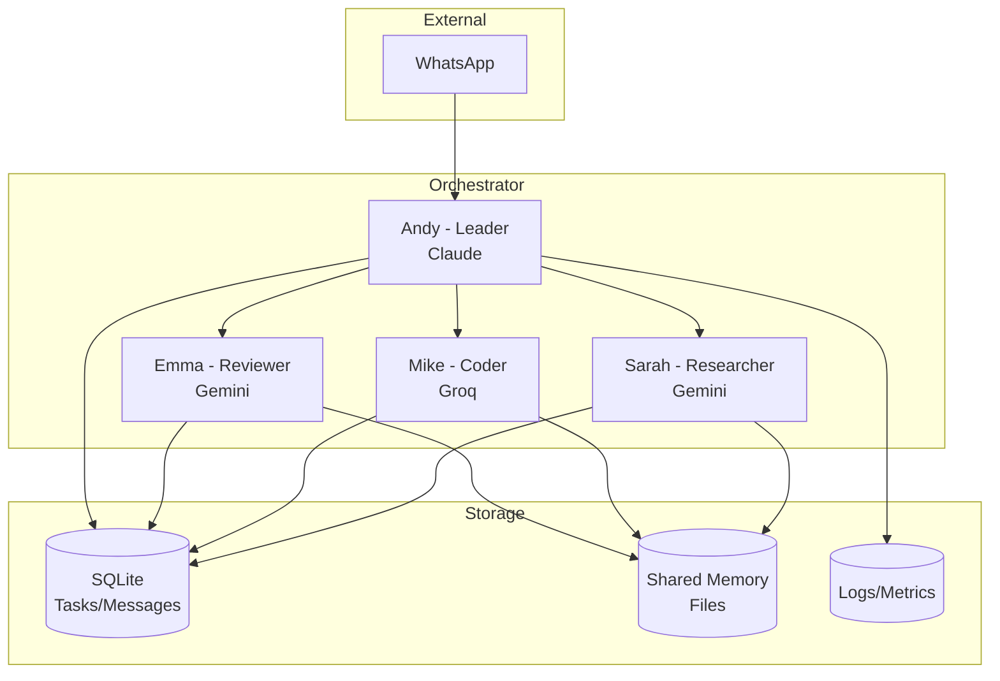
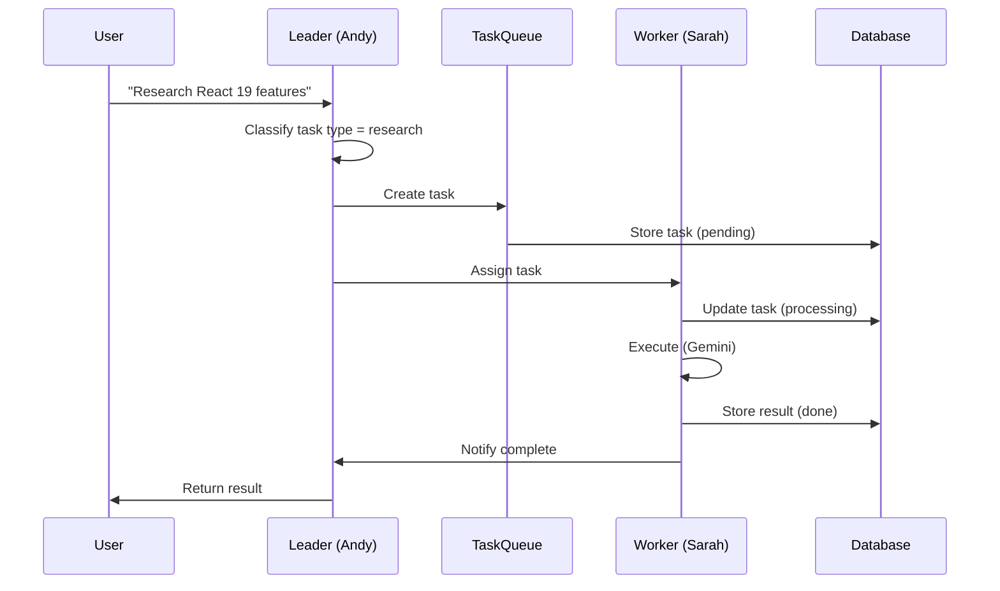

# Agent Swarm Architecture

## Overview

Agent Swarm là hệ thống multi-agent cho phép nhiều AI agents làm việc cùng nhau như một team được điều phối bởi leader agent.

### Key Features
- **Leader-Worker Pattern**: Andy (leader) điều phối, workers thực thi
- **Free Model Priority**: Workers dùng Gemini/Groq (free), Leader dùng Claude
- **Parallel Execution**: Nhiều tasks chạy đồng thời
- **Auto Fallback**: Tự động retry với model khác khi fail
- **Shared Memory**: Team knowledge accessible to all agents
- **Cost Tracking**: Theo dõi chi phí per agent

## Architecture



## Components

### 1. Agent Orchestrator (`src/orchestrator/`)

```typescript
// src/orchestrator/index.ts
interface OrchestratorConfig {
  leader: AgentConfig;
  workers: WorkerConfig[];
  database: DatabaseConfig;
  messaging: MessagingConfig;
}
```

### 2. Leader Agent

**Responsibilities:**
- Nhận message từ user
- Phân loại task type
- Chọn worker phù hợp
- Delegate task
- Tổng hợp kết quả
- Xử lý fallback

**Task Classification:**
| Keywords | Task Type | Assigned To |
|----------|-----------|-------------|
| research, tìm, tìm hiểu | research | researcher |
| code, implement, viết | code | coder |
| review, check, kiểm tra | review | reviewer |
| write, viết docs, document | write | writer |

### 3. Worker Agents

| Agent | Role | Model | Use Case |
|-------|------|-------|----------|
| Sarah | Researcher | gemini-2.0-flash | Research, search, analyze |
| Mike | Coder | groq-llama-3.3 | Write code, implement |
| Emma | Reviewer | gemini-2.0-flash | Review, check, validate |
| Alex | Writer | groq-llama-3.3 | Documentation, content |

### 4. Task Queue

```typescript
interface Task {
  id: string;
  type: 'research' | 'code' | 'review' | 'write' | 'general';
  priority: number;
  prompt: string;
  context?: string;
  assignedTo?: string;
  status: 'pending' | 'assigned' | 'processing' | 'done' | 'failed';
  result?: string;
  createdAt: Date;
  startedAt?: Date;
  completedAt?: Date;
  timeout: number;
  retries: number;
  maxRetries: number;
}
```

### 5. Messaging System

**Message Types:**
- `task_assign`: Leader assigns task to worker
- `task_result`: Worker returns result
- `task_failed`: Worker reports failure
- `query`: Worker asks question
- `reply`: Response to query
- `broadcast`: Leader broadcasts to all

### 6. Shared Memory

```
data/
├── shared/
│   ├── memory.db          # SQLite for structured data
│   ├── knowledge/         # Knowledge files
│   │   ├── project.md
│   │   └── preferences.md
│   └── context/           # Session context
│       └── current.md
```

## Database Schema

### agents table
```sql
CREATE TABLE agents (
  id TEXT PRIMARY KEY,
  role TEXT NOT NULL,
  model TEXT NOT NULL,
  status TEXT DEFAULT 'idle',
  current_task TEXT,
  last_heartbeat TIMESTAMP DEFAULT CURRENT_TIMESTAMP,
  total_tasks INTEGER DEFAULT 0,
  success_count INTEGER DEFAULT 0,
  created_at TIMESTAMP DEFAULT CURRENT_TIMESTAMP
);
```

### tasks table
```sql
CREATE TABLE tasks (
  id TEXT PRIMARY KEY,
  type TEXT NOT NULL,
  priority INTEGER DEFAULT 0,
  prompt TEXT NOT NULL,
  context TEXT,
  from_agent TEXT NOT NULL,
  to_agent TEXT,
  status TEXT DEFAULT 'pending',
  result TEXT,
  error TEXT,
  tokens_used INTEGER,
  cost REAL,
  created_at TIMESTAMP DEFAULT CURRENT_TIMESTAMP,
  started_at TIMESTAMP,
  completed_at TIMESTAMP,
  timeout INTEGER DEFAULT 300000,
  retries INTEGER DEFAULT 0
);
```

### messages table
```sql
CREATE TABLE messages (
  id TEXT PRIMARY KEY,
  from_agent TEXT NOT NULL,
  to_agent TEXT,
  type TEXT NOT NULL,
  content TEXT NOT NULL,
  task_id TEXT,
  read_at TIMESTAMP,
  created_at TIMESTAMP DEFAULT CURRENT_TIMESTAMP
);
```

### shared_memory table
```sql
CREATE TABLE shared_memory (
  key TEXT PRIMARY KEY,
  value TEXT NOT NULL,
  type TEXT DEFAULT 'string',
  updated_by TEXT NOT NULL,
  updated_at TIMESTAMP DEFAULT CURRENT_TIMESTAMP,
  expires_at TIMESTAMP
);
```

## Task Flow



## Error Handling

### Fallback Chain
```
Primary: gemini-2.0-flash
    ↓ (fail)
Secondary: groq-llama-3.3
    ↓ (fail)
Tertiary: claude-haiku (paid)
    ↓ (fail)
Return error to user
```

### Retry Strategy
- Max retries: 3
- Backoff: exponential (1s, 2s, 4s)
- On final failure: notify leader

### Agent Recovery
- Heartbeat check mỗi 30s
- If no heartbeat > 60s: mark offline
- Reassign pending tasks
- Log incident

## Configuration

```json
// config/agent-swarm.json
{
  "leader": {
    "id": "andy",
    "model": "claude-sonnet",
    "systemPrompt": "You are Andy, the leader of an AI agent team..."
  },
  "workers": [
    {
      "id": "sarah",
      "role": "researcher",
      "model": "gemini-2.0-flash",
      "fallbackModel": "groq-llama-3.3",
      "maxConcurrent": 2,
      "timeout": 120000
    },
    {
      "id": "mike",
      "role": "coder",
      "model": "groq-llama-3.3",
      "fallbackModel": "gemini-2.0-flash",
      "maxConcurrent": 1,
      "timeout": 180000
    },
    {
      "id": "emma",
      "role": "reviewer",
      "model": "gemini-2.0-flash",
      "fallbackModel": "groq-llama-3.3",
      "maxConcurrent": 2,
      "timeout": 120000
    }
  ],
  "queue": {
    "maxSize": 100,
    "priorityLevels": 3,
    "defaultTimeout": 300000
  },
  "messaging": {
    "pollInterval": 1000,
    "maxMessageSize": 1048576,
    "retention": 604800000
  },
  "costTracking": {
    "enabled": true,
    "models": {
      "gemini-2.0-flash": { "input": 0, "output": 0 },
      "groq-llama-3.3": { "input": 0, "output": 0 },
      "claude-haiku": { "input": 0.25, "output": 1.25 },
      "claude-sonnet": { "input": 3, "output": 15 }
    }
  }
}
```

## Integration Points

### WhatsApp Channel
```typescript
// src/channels/whatsapp/handler.ts
async function handleMessage(message: string, from: string) {
  // 1. Send to leader
  const result = await orchestrator.process(message, {
    userId: from,
    channel: 'whatsapp'
  });
  
  // 2. Return response
  return result;
}
```

### LLM Provider Integration
The orchestrator uses `LLMProviderService` to call models via:
1. **OpenCode CLI** - Primary method for free models (GLM-4.7-flash, GLM-5, etc.)
2. **Direct API** - For Google Gemini, Groq, Anthropic (when API keys configured)

```typescript
// Example: Call model with automatic fallback
const result = await orchestrator.callModelWithFallback(
  ['glm-4.7-flash', 'glm-4.5-flash', 'glm-5'],
  'What is React 19?',
  'Context: User is asking about frontend frameworks.',
  'You are a helpful research assistant.'
);
```

### Supported Models

| Model | Provider | Free | Best For |
|-------|----------|------|----------|
| glm-4.7-flash | OpenCode | ✅ | Research, simple tasks |
| glm-5 | OpenCode | ✅ | Coding, complex tasks |
| glm-4.5-flash | OpenCode | ✅ | Fallback |
| big-pickle | OpenCode | ✅ | General |
| claude-sonnet | Anthropic | ❌ | Leader decisions |
| claude-haiku | Anthropic | ❌ | Fast responses |

### Streaming Support
```typescript
// Stream responses for real-time output
for await (const chunk of orchestrator.streamModel('glm-4.7-flash', prompt)) {
  if (chunk.content) {
    process.stdout.write(chunk.content);
  }
}
```

## Monitoring

### Metrics
- Tasks per minute
- Average task duration
- Success rate per agent
- Token usage per model
- Cost per day

### Logs
```
[andy] Task created: research-123 (research)
[andy] Assigned to: sarah
[sarah] Processing task: research-123
[sarah] Completed in 4.2s, tokens: 1234
[andy] Result returned to user
```

## Security

- Inter-agent communication via SQLite (no network exposure)
- API keys stored in environment variables
- No external API for agent control
- Rate limiting per agent

## Deployment

### Single Process Mode
```bash
npm run orchestrator:start
```

### Docker Mode (Future)
```yaml
services:
  orchestrator:
    build: .
    environment:
      - ANTHROPIC_API_KEY=${ANTHROPIC_API_KEY}
      - GEMINI_API_KEY=${GEMINI_API_KEY}
      - GROQ_API_KEY=${GROQ_API_KEY}
```
