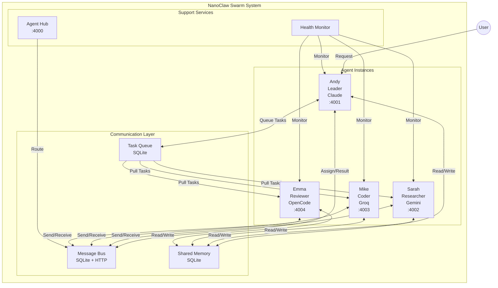

# System Design: Agent Swarm

## Architecture Overview



### Component Overview

| Component | Port | Responsibility |
|-----------|------|----------------|
| **Agent Hub** | 4000 | Central routing, agent registry |
| **Andy (Leader)** | 4001 | Coordination, user interaction, delegation |
| **Sarah (Researcher)** | 4002 | Research, documentation, web search |
| **Mike (Coder)** | 4003 | Code implementation, refactoring |
| **Emma (Reviewer)** | 4004 | Code review, quality checks |

### Technology Stack

| Layer | Technology | Rationale |
|-------|------------|-----------|
| **Database** | SQLite | Built-in, zero config, sufficient for single VPS |
| **Communication** | SQLite + HTTP | Simple, reliable, no external dependencies |
| **Agent Runtime** | Bun + TypeScript | Consistent with NanoClaw core |
| **Worker Models** | OpenCode CLI | Free access to Gemini, Groq, etc. |
| **Leader Model** | Claude SDK | Best reasoning for coordination |

## Data Models

### Agent Registry

```typescript
interface SwarmAgent {
  id: string;                    // 'andy' | 'sarah' | 'mike' | 'emma'
  name: string;                  // Display name
  role: AgentRole;               // 'leader' | 'researcher' | 'coder' | 'reviewer'
  model: string;                 // 'claude-3-5-sonnet' | 'gemini-2.0-flash'
  provider: string;              // 'claude' | 'opencode'
  endpoint: string;              // 'http://localhost:4001'
  status: AgentStatus;           // 'idle' | 'busy' | 'offline'
  capabilities: string[];        // ['research', 'web-search']
  currentTask: string | null;    // Task ID if busy
  lastHeartbeat: Date;
  stats: AgentStats;
}

type AgentRole = 'leader' | 'researcher' | 'coder' | 'reviewer';
type AgentStatus = 'idle' | 'busy' | 'offline' | 'error';

interface AgentStats {
  tasksCompleted: number;
  tasksFailed: number;
  avgResponseTimeMs: number;
  totalTokensUsed: number;
}
```

### Message System

```typescript
interface SwarmMessage {
  id: string;
  from: string;                  // Agent ID
  to: string | 'all';            // Agent ID or 'all' for broadcast
  channel: MessageChannel;
  type: MessageType;
  content: string;
  metadata?: MessageMetadata;
  timestamp: Date;
  readBy: string[];              // Agent IDs who read this
}

type MessageChannel = 
  | 'team'                       // Team-wide discussions
  | 'direct'                     // Private 1:1
  | 'tasks'                      // Task assignments
  | 'results'                    // Task results
  | 'alerts';                    // System alerts

type MessageType =
  | 'broadcast'                  // Broadcast to all
  | 'direct'                     // Direct message
  | 'task_assign'                // Assign task
  | 'task_update'                // Task progress
  | 'task_complete'              // Task done
  | 'task_failed'                // Task failed
  | 'question'                   // Ask question
  | 'answer'                     // Answer question
  | 'help'                       // Request help
  | 'status'                     // Status update
  | 'heartbeat';                 // Keepalive

interface MessageMetadata {
  taskId?: string;
  priority?: 'low' | 'normal' | 'high' | 'urgent';
  deadline?: Date;
  replyTo?: string;              // Message ID being replied to
  attachments?: string[];        // File paths
}
```

### Task System

```typescript
interface SwarmTask {
  id: string;
  title: string;
  description: string;
  createdBy: string;             // Agent ID
  assignedTo: string | null;     // Agent ID
  status: TaskStatus;
  priority: TaskPriority;
  result?: string;
  error?: string;
  dependencies: string[];        // Task IDs that must complete first
  createdAt: Date;
  startedAt?: Date;
  completedAt?: Date;
  deadline?: Date;
  metadata?: Record<string, any>;
}

type TaskStatus = 
  | 'pending'                    // Waiting to be picked up
  | 'assigned'                   // Assigned to agent
  | 'in_progress'                // Being worked on
  | 'completed'                  // Successfully completed
  | 'failed'                     // Failed with error
  | 'cancelled';                 // Cancelled

type TaskPriority = 'low' | 'normal' | 'high' | 'urgent';
```

### Shared Memory

```typescript
interface SwarmMemory {
  key: string;                   // Unique key
  value: any;                    // JSON value
  type: MemoryType;
  updatedBy: string;             // Agent ID
  updatedAt: Date;
  expiresAt?: Date;              // Optional TTL
  tags: string[];                // For search
}

type MemoryType = 
  | 'knowledge'                  // General knowledge
  | 'context'                    // Project context
  | 'decision'                   // Team decisions
  | 'preference';                // User preferences
```

### Database Schema

```sql
-- Agent Registry
CREATE TABLE swarm_agents (
  id TEXT PRIMARY KEY,
  name TEXT NOT NULL,
  role TEXT NOT NULL,
  model TEXT NOT NULL,
  provider TEXT NOT NULL,
  endpoint TEXT NOT NULL,
  status TEXT DEFAULT 'offline',
  capabilities TEXT,             -- JSON array
  current_task TEXT,
  last_heartbeat TEXT,
  stats TEXT,                    -- JSON object
  created_at TEXT DEFAULT CURRENT_TIMESTAMP
);

-- Messages
CREATE TABLE swarm_messages (
  id TEXT PRIMARY KEY,
  from_agent TEXT NOT NULL,
  to_agent TEXT,                 -- NULL for broadcast
  channel TEXT NOT NULL,
  type TEXT NOT NULL,
  content TEXT NOT NULL,
  metadata TEXT,                 -- JSON
  read_by TEXT,                  -- JSON array
  created_at TEXT DEFAULT CURRENT_TIMESTAMP
);

CREATE INDEX idx_messages_to ON swarm_messages(to_agent, read_by);
CREATE INDEX idx_messages_channel ON swarm_messages(channel, created_at);

-- Tasks
CREATE TABLE swarm_tasks (
  id TEXT PRIMARY KEY,
  title TEXT NOT NULL,
  description TEXT,
  created_by TEXT NOT NULL,
  assigned_to TEXT,
  status TEXT DEFAULT 'pending',
  priority TEXT DEFAULT 'normal',
  result TEXT,
  error TEXT,
  dependencies TEXT,             -- JSON array
  created_at TEXT DEFAULT CURRENT_TIMESTAMP,
  started_at TEXT,
  completed_at TEXT,
  deadline TEXT,
  metadata TEXT                  -- JSON
);

CREATE INDEX idx_tasks_status ON swarm_tasks(status, priority);
CREATE INDEX idx_tasks_assigned ON swarm_tasks(assigned_to, status);

-- Shared Memory
CREATE TABLE swarm_memory (
  key TEXT PRIMARY KEY,
  value TEXT NOT NULL,
  type TEXT DEFAULT 'knowledge',
  updated_by TEXT NOT NULL,
  updated_at TEXT DEFAULT CURRENT_TIMESTAMP,
  expires_at TEXT,
  tags TEXT                      -- JSON array
);

CREATE INDEX idx_memory_tags ON swarm_memory(tags);
CREATE INDEX idx_memory_expires ON swarm_memory(expires_at);
```

## API Design

### Internal API (Agent-to-Agent)

```typescript
// HTTP endpoints each agent exposes
interface AgentAPI {
  // Message handling
  POST /message
  body: SwarmMessage
  response: { received: boolean }

  // Task handling
  POST /task
  body: SwarmTask
  response: { accepted: boolean; estimatedTime?: number }

  GET /task/:id/status
  response: { status: TaskStatus; progress?: number }

  // Health
  GET /health
  response: { status: AgentStatus; currentTask?: string }

  // Memory
  POST /memory
  body: { key: string; value: any }
  response: { success: boolean }

  GET /memory/:key
  response: { value: any; updatedAt: Date }
}
```

### Tool Interface (For Claude)

```typescript
const swarmTools = {
  // Communication
  swarm_send_message: {
    description: 'Send message to another agent or broadcast to team',
    parameters: {
      to: { type: 'string', description: 'Agent ID or "all"' },
      message: { type: 'string' },
      type: { type: 'string', enum: ['broadcast', 'direct', 'question', 'help'] },
      channel: { type: 'string', enum: ['team', 'direct', 'tasks', 'alerts'] },
    },
  },

  swarm_get_messages: {
    description: 'Get unread messages',
    parameters: {
      channel: { type: 'string', optional: true },
      limit: { type: 'number', default: 10 },
    },
  },

  // Task Management
  swarm_assign_task: {
    description: 'Assign task to another agent',
    parameters: {
      agent: { type: 'string', description: 'Agent ID' },
      title: { type: 'string' },
      description: { type: 'string' },
      priority: { type: 'string', enum: ['low', 'normal', 'high', 'urgent'] },
      deadline: { type: 'string', optional: true },
    },
  },

  swarm_check_task: {
    description: 'Check task status',
    parameters: {
      taskId: { type: 'string' },
    },
  },

  swarm_list_tasks: {
    description: 'List tasks (filtered by status)',
    parameters: {
      status: { type: 'string', optional: true },
      agent: { type: 'string', optional: true },
    },
  },

  // Memory
  swarm_set_memory: {
    description: 'Store shared knowledge',
    parameters: {
      key: { type: 'string' },
      value: { type: 'any' },
      type: { type: 'string', enum: ['knowledge', 'context', 'decision'] },
    },
  },

  swarm_get_memory: {
    description: 'Retrieve shared knowledge',
    parameters: {
      key: { type: 'string' },
    },
  },

  swarm_search_memory: {
    description: 'Search shared memory by tags',
    parameters: {
      tags: { type: 'array', items: { type: 'string' } },
    },
  },

  // Team Management
  swarm_list_agents: {
    description: 'List all agents and their status',
    parameters: {},
  },

  swarm_get_agent: {
    description: 'Get agent details',
    parameters: {
      agentId: { type: 'string' },
    },
  },
};
```

## Component Breakdown

### 1. Communication Layer (`src/swarm/communication/`)

```
src/swarm/communication/
├── message-bus.ts      # SQLite-based message routing
├── notifier.ts         # HTTP notification sender
├── receiver.ts         # HTTP server for incoming messages
└── types.ts            # Message types
```

### 2. Task System (`src/swarm/tasks/`)

```
src/swarm/tasks/
├── queue.ts            # Task queue management
├── scheduler.ts        # Task scheduling logic
├── tracker.ts          # Task status tracking
└── types.ts            # Task types
```

### 3. Shared Memory (`src/swarm/memory/`)

```
src/swarm/memory/
├── store.ts            # Memory CRUD operations
├── search.ts           # Tag-based search
├── cache.ts            # In-memory cache layer
└── types.ts            # Memory types
```

### 4. Agent Runtime (`src/swarm/agent/`)

```
src/swarm/agent/
├── agent.ts            # Base agent class
├── leader.ts           # Leader agent (Andy)
├── worker.ts           # Worker agent base
├── health.ts           # Heartbeat & monitoring
└── tools.ts            # Swarm tools for Claude
```

### 5. Agent Hub (`src/swarm/hub/`)

```
src/swarm/hub/
├── registry.ts         # Agent registration
├── router.ts           # Message routing
├── monitor.ts          # Health monitoring
└── api.ts              # Hub HTTP API
```

## Design Decisions

### Decision 1: SQLite vs In-Memory Message Bus

| Option | Pros | Cons |
|--------|------|------|
| SQLite | Persistent, queryable, built-in | Slower than memory |
| In-Memory | Fast | Lost on restart |
| Redis | Fast, persistent | External dependency |

**Decision:** SQLite
**Rationale:** 
- Built-in, zero config
- Persistence for debugging
- Sufficient performance for 4-8 agents
- Simple deployment

### Decision 2: HTTP vs WebSocket Notifications

| Option | Pros | Cons |
|--------|------|------|
| HTTP | Simple, stateless | Polling required |
| WebSocket | Real-time | Connection management |
| Hybrid | Best of both | More complex |

**Decision:** Hybrid (SQLite + HTTP notifications)
**Rationale:**
- Messages stored in SQLite (persistent)
- HTTP POST for immediate notification
- Fallback to polling if notification fails
- Simple and reliable

### Decision 3: Agent Process Model

| Option | Description | Pros | Cons |
|--------|-------------|------|------|
| Same process | All agents in one process | Simple | No isolation |
| Child processes | Spawn as subprocesses | Isolation | Complex lifecycle |
| HTTP servers | Each agent is HTTP server | Full isolation | More resources |

**Decision:** HTTP servers (one per agent)
**Rationale:**
- Each agent can be independently restarted
- Clear separation of concerns
- Can distribute across machines later
- Easy debugging (dedicated port)

### Decision 4: Leader Election

| Option | Description |
|--------|-------------|
| Static | Andy is always leader |
| Dynamic | Agents vote for leader |
| Rotating | Leader role rotates |

**Decision:** Static (Andy is always leader)
**Rationale:**
- Simpler implementation
- Clear responsibility
- Claude is best for reasoning/coordination
- Avoids election overhead

### Decision 5: OpenCode Integration

| Option | Description |
|--------|-------------|
| CLI subprocess | Spawn `opencode run` for each task |
| HTTP API | Use `opencode serve` |
| SDK | Use OpenCode as library |

**Decision:** CLI subprocess with optional HTTP fallback
**Rationale:**
- CLI is simplest for single tasks
- No server to manage
- Can add HTTP server for high-volume

## Non-Functional Requirements

### Performance

| Metric | Target | Measurement |
|--------|--------|-------------|
| Message delivery | <100ms | HTTP POST time |
| Task assignment | <50ms | DB write + notify |
| Memory read | <10ms | SQLite query |
| Memory write | <20ms | SQLite write |
| Agent startup | <5s | Process spawn + init |
| Concurrent tasks | 4+ | Parallel workers |

### Scalability

| Dimension | Limit | Reason |
|-----------|-------|--------|
| Agents | 8 per VPS | Memory constraint |
| Messages/day | 10,000 | SQLite capacity |
| Tasks/day | 1,000 | Reasonable for personal use |
| Memory entries | 1,000 | SQLite capacity |

### Reliability

| Requirement | Implementation |
|-------------|----------------|
| Agent crash recovery | Auto-restart with PM2 |
| Message persistence | SQLite (ACID) |
| Task persistence | SQLite with status tracking |
| Offline agent handling | Timeout + reassign |

### Security

| Requirement | Implementation |
|-------------|----------------|
| Inter-agent auth | Shared secret (env var) |
| API key protection | Env vars only |
| Message encryption | Optional TLS |
| Container isolation | Each agent in container (optional) |

## File Structure

```
src/swarm/
├── index.ts                    # Public exports
├── types.ts                    # Shared types
│
├── communication/
│   ├── index.ts
│   ├── message-bus.ts          # SQLite message routing
│   ├── notifier.ts             # HTTP notification
│   ├── receiver.ts             # HTTP server
│   └── types.ts
│
├── tasks/
│   ├── index.ts
│   ├── queue.ts                # Task queue
│   ├── scheduler.ts            # Scheduling
│   ├── tracker.ts              # Status tracking
│   └── types.ts
│
├── memory/
│   ├── index.ts
│   ├── store.ts                # CRUD operations
│   ├── search.ts               # Tag search
│   └── types.ts
│
├── agent/
│   ├── index.ts
│   ├── base.ts                 # Base agent class
│   ├── leader.ts               # Leader (Andy)
│   ├── worker.ts               # Worker base
│   ├── tools.ts                # Claude tools
│   ├── health.ts               # Heartbeat
│   └── prompts/                # System prompts
│       ├── leader.md
│       ├── researcher.md
│       ├── coder.md
│       └── reviewer.md
│
├── hub/
│   ├── index.ts
│   ├── registry.ts             # Agent registry
│   ├── router.ts               # Message routing
│   ├── monitor.ts              # Health checks
│   └── api.ts                  # HTTP API
│
└── db/
    ├── index.ts                # Database connection
    ├── schema.sql              # Schema definitions
    └── migrations/             # Schema migrations
        └── 001_initial.sql
```

## Integration Points

### Existing NanoClaw Integration

| File | Changes |
|------|---------|
| `src/index.ts` | Add swarm initialization option |
| `src/db.ts` | Add swarm tables migration |
| `src/container-runner.ts` | Support swarm tools |
| `groups/{name}/CLAUDE.md` | Add swarm tools documentation |

### Environment Variables

```bash
# Swarm Configuration
SWARM_ENABLED=true
SWARM_DB_PATH=/data/swarm.db
SWARM_HUB_PORT=4000

# Agent Configuration
AGENT_ID=andy
AGENT_ROLE=leader
AGENT_PORT=4001

# OpenCode (for workers)
OPENCODE_PATH=/usr/local/bin/opencode

# Inter-agent Auth
SWARM_SECRET=<shared-secret>
```

### Startup Scripts

```bash
# scripts/start-swarm.sh
#!/bin/bash

# Start Hub
bun run src/swarm/hub/index.ts &

# Start Agents
AGENT_ID=andy AGENT_ROLE=leader AGENT_PORT=4001 bun run start &
AGENT_ID=sarah AGENT_ROLE=researcher AGENT_PORT=4002 LLM_PROVIDER=opencode bun run start &
AGENT_ID=mike AGENT_ROLE=coder AGENT_PORT=4003 LLM_PROVIDER=opencode bun run start &
AGENT_ID=emma AGENT_ROLE=reviewer AGENT_PORT=4004 LLM_PROVIDER=opencode bun run start &
```
