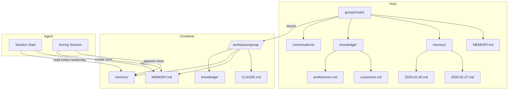

# System Design & Architecture

## Architecture Overview
**What is the high-level system structure?**



**Key components:**
- **MEMORY.md**: Long-term curated facts (preferences, contacts, key info)
- **memory/**: Daily logs (append-only, date-stamped)
- **knowledge/**: Structured indexed data (customers, projects, etc.)
- **conversations/**: Archived session transcripts

## Data Models
**What data do we need to manage?**

### MEMORY.md Structure
```markdown
# Memory

## Preferences
- Response style: concise
- Language: Vietnamese preferred
- Timezone: Asia/Ho_Chi_Minh

## Contacts
### John Doe
- Email: john@example.com
- Role: Developer

## Projects
### Project Alpha
- Status: active
- Priority: high

## Key Decisions
- 2026-02-27: Decided to use PostgreSQL over MySQL
```

### Daily Log Structure (memory/YYYY-MM-DD.md)
```markdown
# 2026-02-27

## Session Notes
- Discussed new feature requirements
- User mentioned preference for dark mode

## Tasks Completed
- Implemented auth flow

## Important Facts
- Customer X prefers morning meetings
```

### Knowledge File Structure
```markdown
# Customers

## Acme Corp
- Contact: John Doe
- Contract: Enterprise
- Notes: Prefers quarterly reviews

## Beta Inc
- Contact: Jane Smith
- Contract: Startup
- Notes: Fast-growing, needs scalability
```

## API Design
**How do components communicate?**

### File-based API (no code changes needed)
- **Read**: Agent uses existing `Read` tool
- **Write**: Agent uses existing `Write`/`Edit` tools
- **Search**: Agent uses existing `Grep`/`Glob` tools

### Memory Loading Protocol
1. At session start, read `MEMORY.md`
2. Read `memory/YYYY-MM-DD.md` (today)
3. Read `memory/YYYY-MM-DD-1.md` (yesterday)
4. Agent has context restored

### Memory Writing Protocol
1. For daily notes: append to `memory/YYYY-MM-DD.md`
2. For permanent facts: update `MEMORY.md`
3. For structured data: update/create in `knowledge/`

## Component Breakdown
**What are the major building blocks?**

### Host-side
| Component | Location | Purpose |
|-----------|----------|---------|
| Group folder | `groups/main/` | Root for all memory |
| MEMORY.md | `groups/main/MEMORY.md` | Long-term memory |
| memory/ | `groups/main/memory/` | Daily logs |
| knowledge/ | `groups/main/knowledge/` | Structured data |

### Container-side
| Component | Mount | Access |
|-----------|-------|--------|
| /workspace/group/ | groups/main/ | read-write |

### Agent-side
| Tool | Usage |
|------|-------|
| Read | Load memory files |
| Write | Create daily logs |
| Edit | Update MEMORY.md |

## Design Decisions
**Why did we choose this approach?**

### Decision 1: Markdown over Database
- **Chosen**: Plain Markdown files
- **Alternatives**: SQLite, JSON files
- **Rationale**: Human-readable, version-controllable, no migration needed

### Decision 2: Date-based Daily Logs
- **Chosen**: `YYYY-MM-DD.md` format
- **Alternatives**: Single rolling file, weekly files
- **Rationale**: Easy to find by date, natural cleanup, follows OpenClaw pattern

### Decision 3: No Auto-compaction
- **Chosen**: Manual curation to MEMORY.md
- **Alternatives**: Auto-summarize daily logs
- **Rationale**: User control over what's remembered, simpler implementation

## Non-Functional Requirements
**How should the system perform?**

### Performance
- Memory load at session start: <100ms
- Daily log append: <50ms
- MEMORY.md update: <50ms

### Scalability
- MEMORY.md: Max 500 lines (split if larger)
- Daily logs: Auto-archived after 30 days
- Knowledge files: Max 500 lines each (split into subfolders)

### Reliability
- Graceful handling of missing files
- No data loss on write failure
- Backup via git (user responsibility)
