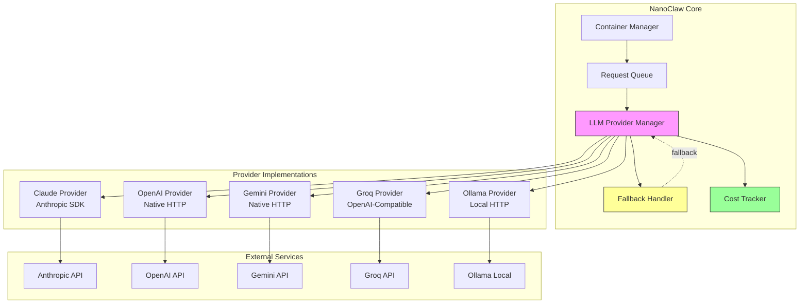

# System Design: Multi-LLM Provider Support

## Architecture Overview



### Key Components

| Component | Responsibility |
|-----------|---------------|
| **LLM Provider Manager** | Route requests to correct provider, manage provider lifecycle |
| **Provider Interface** | Abstract interface for all LLM implementations |
| **Fallback Handler** | Retry with next provider on failure |
| **Cost Tracker** | Track token usage and costs per provider |
| **Provider Config** | Load API keys, model mappings from env |

### Technology Choices

| Choice | Rationale |
|--------|-----------|
| **Provider Interface** | TypeScript interface ensures consistent API |
| **Native HTTP** | Avoid heavy SDK dependencies for OpenAI/Gemini |
| **OpenAI-Compatible** | Reuse implementation for Groq, etc. |
| **SQLite** | Built-in cost tracking, no external DB |

## Data Models

### Provider Configuration

```typescript
interface LLMProviderConfig {
  name: string;                    // 'claude' | 'openai' | 'gemini' | 'groq' | 'ollama'
  apiKeyEnvVar: string;            // 'ANTHROPIC_API_KEY' | 'OPENAI_API_KEY' | etc.
  baseUrl?: string;                // For Ollama: 'http://localhost:11434'
  models: ModelConfig[];
  defaultModel: string;
  enabled: boolean;
  priority: number;                // Fallback order
}

interface ModelConfig {
  id: string;                      // 'gpt-4o' | 'claude-sonnet-4' | 'llama3'
  inputCost: number;               // $ per 1M tokens
  outputCost: number;              // $ per 1M tokens
  contextWindow: number;           // Max tokens
  supportsStreaming: boolean;
  supportsVision: boolean;
}
```

### Cost Tracking

```typescript
interface CostRecord {
  id: string;
  provider: string;
  model: string;
  inputTokens: number;
  outputTokens: number;
  cost: number;                    // USD
  timestamp: Date;
  sessionId: string;
  success: boolean;
  error?: string;
}
```

### Provider State

```typescript
interface ProviderState {
  name: string;
  available: boolean;
  lastCheck: Date;
  errorCount: number;
  totalRequests: number;
  avgLatency: number;
}
```

## API Design

### Internal Provider Interface

```typescript
interface LLMProvider {
  readonly name: string;
  
  // Core methods
  chat(messages: Message[], options?: ChatOptions): Promise<string>;
  chatStream(messages: Message[], options?: ChatOptions): AsyncIterable<string>;
  
  // Capabilities
  isAvailable(): Promise<boolean>;
  getModels(): ModelConfig[];
  
  // Health
  healthCheck(): Promise<HealthStatus>;
}

interface ChatOptions {
  model?: string;
  maxTokens?: number;
  temperature?: number;
  systemPrompt?: string;
  stopSequences?: string[];
}

interface Message {
  role: 'system' | 'user' | 'assistant';
  content: string;
}
```

### User Commands

```typescript
// CLI commands
interface LLMCommands {
  '/switch-model <provider>[:model]': void;    // Switch provider/model
  '/models': ModelInfo[];                       // List available models
  '/costs [--provider] [--today|--week]': CostSummary;
  '/provider-status': ProviderStatus[];         // Health check all
}
```

### Configuration API

```typescript
interface ProviderConfigAPI {
  getActive(): string;                          // Current provider
  setActive(provider: string, model?: string): void;
  getFallbackChain(): string[];                 // Provider priority
  setFallbackChain(providers: string[]): void;
  getProviderConfig(name: string): LLMProviderConfig;
}
```

## Component Breakdown

### 1. Provider Interface (`src/llm/types.ts`)

```typescript
// Abstract interface all providers implement
export interface LLMProvider {
  name: string;
  chat(messages: Message[], options?: ChatOptions): Promise<string>;
  chatStream(messages: Message[], options?: ChatOptions): AsyncIterable<string>;
  isAvailable(): Promise<boolean>;
}
```

### 2. Provider Implementations (`src/llm/providers/`)

```
src/llm/providers/
├── claude.ts       # Anthropic SDK (existing)
├── openai.ts       # Native HTTP
├── gemini.ts       # Native HTTP
├── groq.ts         # OpenAI-compatible
├── ollama.ts       # Local HTTP
└── base.ts         # Shared utilities
```

### 3. Provider Manager (`src/llm/manager.ts`)

```typescript
export class LLMProviderManager {
  private providers: Map<string, LLMProvider>;
  private activeProvider: string;
  private fallbackChain: string[];
  
  async chat(messages: Message[], options?: ChatOptions): Promise<string>;
  async chatStream(messages: Message[], options?: ChatOptions): AsyncIterable<string>;
  setActiveProvider(name: string, model?: string): void;
  getAvailableProviders(): ProviderState[];
}
```

### 4. Fallback Handler (`src/llm/fallback.ts`)

```typescript
export class FallbackHandler {
  private maxRetries: number = 3;
  private backoffMs: number = 1000;
  
  async executeWithFallback<T>(
    operation: () => Promise<T>,
    providers: string[]
  ): Promise<T>;
}
```

### 5. Cost Tracker (`src/llm/costs.ts`)

```typescript
export class CostTracker {
  async record(record: CostRecord): Promise<void>;
  async getSummary(filter: CostFilter): Promise<CostSummary>;
  async export(format: 'csv' | 'json'): Promise<string>;
}
```

## Design Decisions

### Decision 1: Provider Abstraction Level

**Options considered:**
1. **SDK-based** (use official SDKs)
   - Pros: Type-safe, maintained
   - Cons: Heavy dependencies, inconsistent APIs

2. **HTTP-native** (direct API calls)
   - Pros: Lightweight, consistent
   - Cons: More code, manual maintenance

3. **Hybrid** (SDK for Claude, HTTP for others)
   - Pros: Best of both worlds
   - Cons: Inconsistent patterns

**Decision:** Hybrid approach
- Claude: Use existing Anthropic SDK (already integrated)
- Others: Native HTTP with shared utilities
- Rationale: Claude SDK already works, HTTP is lighter for others

### Decision 2: Streaming Implementation

**Challenge:** Each provider streams differently

**Solution:** Normalize to async iterable
```typescript
// All providers return same interface
async *chatStream(messages, options): AsyncIterable<string> {
  // Provider-specific implementation
  // Yield normalized string chunks
}
```

### Decision 3: Cost Tracking Storage

**Options:**
1. **SQLite table** (chosen)
   - Pros: Built-in, queryable
   - Cons: Schema migration

2. **JSON file**
   - Pros: Simple
   - Cons: Not queryable

3. **In-memory only**
   - Pros: Fast
   - Cons: Lost on restart

**Decision:** SQLite table with automatic migration

### Decision 4: Fallback Strategy

**Options:**
1. **Automatic** (try next provider on any error)
2. **Manual** (user explicitly switches)
3. **Configurable** (user sets strategy)

**Decision:** Configurable with automatic default
- Default: Automatic fallback
- User can disable: `/set-fallback manual`
- Rationale: Best UX, power users can control

## Non-Functional Requirements

### Performance

| Metric | Target |
|--------|--------|
| Provider switch latency | <100ms |
| Streaming first token | <2s (cloud), <500ms (local) |
| Cost record overhead | <10ms |
| Memory per provider | <5MB |

### Security

| Requirement | Implementation |
|-------------|----------------|
| API key storage | Environment variables only |
| Key rotation | No restart required |
| Local model access | localhost only (no external) |
| Cost data | No PII, just tokens |

### Reliability

| Requirement | Implementation |
|-------------|----------------|
| Fallback | 3-level chain with exponential backoff |
| Health checks | Periodic ping every 5 minutes |
| Error recovery | Auto-retry with backoff |
| Graceful degradation | Continue with available providers |

### Compatibility

| Platform | Support |
|----------|---------|
| macOS | ✅ Full (all providers) |
| Linux | ✅ Full (all providers) |
| Windows | ✅ Full (Ollama via WSL) |

## File Structure

```
src/llm/
├── types.ts              # Interfaces and types
├── manager.ts            # Provider manager
├── fallback.ts           # Fallback handler
├── costs.ts              # Cost tracking
├── health.ts             # Health checks
├── config.ts             # Load provider configs
└── providers/
    ├── base.ts           # Shared utilities
    ├── claude.ts         # Anthropic SDK wrapper
    ├── openai.ts         # OpenAI HTTP
    ├── gemini.ts         # Gemini HTTP
    ├── groq.ts           # Groq (OpenAI-compatible)
    └── ollama.ts         # Ollama local

src/commands/
└── llm-commands.ts       # /switch-model, /costs, etc.
```

## Integration Points

### Existing Code Changes

| File | Change |
|------|--------|
| `container-runner.ts` | Replace Claude SDK calls with LLMProviderManager |
| `index.ts` | Register LLM commands, init providers |
| `db.ts` | Add costs table migration |

### Environment Variables

```bash
# Existing
ANTHROPIC_API_KEY=...

# New
OPENAI_API_KEY=...
GOOGLE_AI_API_KEY=...      # Gemini
GROQ_API_KEY=...
OLLAMA_BASE_URL=http://localhost:11434

# Optional
LLM_DEFAULT_PROVIDER=claude
LLM_FALLBACK_CHAIN=claude,openai,gemini
```
