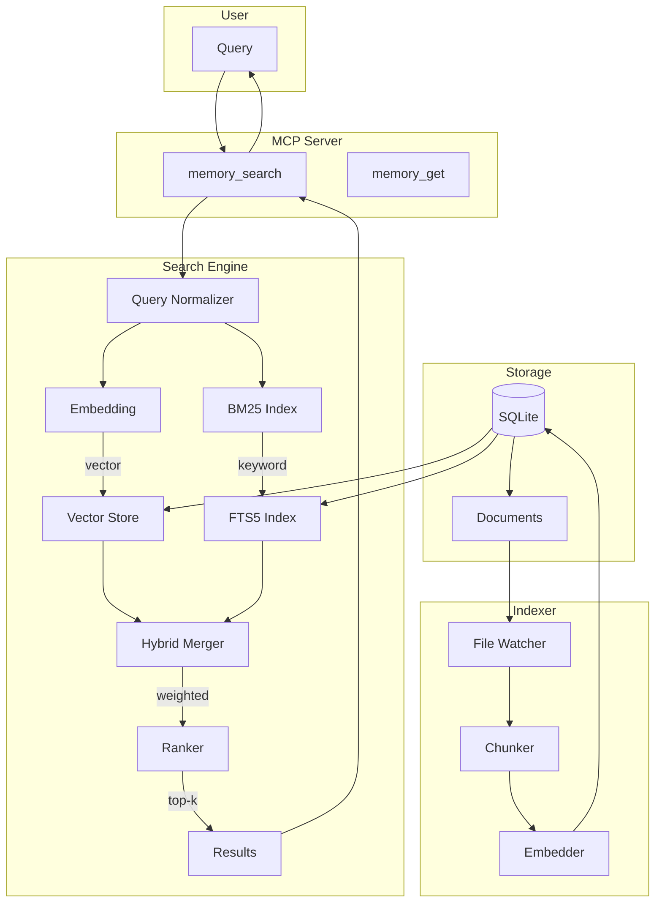

# System Design & Architecture

## Architecture Overview
**What is the high-level system structure?**



**Key components:**
- **MCP Server**: Exposes search tools to agent
- **Search Engine**: Hybrid BM25 + vector search
- **Storage**: SQLite with sqlite-vec extension
- **Indexer**: File watcher + chunker + embedder

## Data Models
**What data do we need to manage?**

### Document Schema
```sql
CREATE TABLE documents (
  id INTEGER PRIMARY KEY,
  path TEXT NOT NULL,           -- Source file path
  chunk_index INTEGER NOT NULL, -- Chunk position in file
  content TEXT NOT NULL,        -- Chunk content
  embedding BLOB,               -- Vector embedding (Float32Array)
  created_at TIMESTAMP,
  updated_at TIMESTAMP,
  
  UNIQUE(path, chunk_index)
);

-- FTS5 for BM25
CREATE VIRTUAL TABLE documents_fts USING fts5(
  content,
  content='documents',
  content_rowid='id'
);

-- Vector search (sqlite-vec)
CREATE VIRTUAL TABLE documents_vec USING vec0(
  embedding FLOAT[1536]  -- OpenRouter/OpenAI embedding dimension
);
```

### Chunk Structure
```typescript
interface Chunk {
  id: number;
  path: string;        // e.g., "knowledge/customers.md"
  chunkIndex: number;  // Position in file
  content: string;     // ~400 tokens, 80-token overlap
  embedding?: number[]; // 1536 dimensions
  lineStart: number;   // For citations
  lineEnd: number;
}
```

### Search Result
```typescript
interface SearchResult {
  path: string;
  lineStart: number;
  lineEnd: number;
  content: string;     // Snippet (~700 chars max)
  score: number;       // Combined BM25 + vector score
  source: 'bm25' | 'vector' | 'hybrid';
}
```

## API Design
**How do components communicate?**

### MCP Tools

#### memory_search
```typescript
{
  name: "memory_search",
  description: "Search memory files using hybrid BM25 + vector search",
  inputSchema: {
    type: "object",
    properties: {
      query: { type: "string", description: "Search query" },
      limit: { type: "number", default: 5, maximum: 20 },
      sources: { 
        type: "array", 
        items: { enum: ["memory", "knowledge", "conversations"] },
        default: ["memory", "knowledge"]
      }
    },
    required: ["query"]
  }
}
```

#### memory_get
```typescript
{
  name: "memory_get",
  description: "Read a specific memory file",
  inputSchema: {
    type: "object",
    properties: {
      path: { type: "string", description: "File path relative to group folder" },
      lineStart: { type: "number" },
      lineCount: { type: "number", default: 100 }
    },
    required: ["path"]
  }
}
```

### Hybrid Search Algorithm
```typescript
async function hybridSearch(query: string, limit: number): Promise<SearchResult[]> {
  // 1. Get embedding for query
  const queryEmbedding = await getEmbedding(query);
  
  // 2. Parallel: BM25 + Vector search
  const [bm25Results, vectorResults] = await Promise.all([
    bm25Search(query, limit * 4),      // Get more candidates
    vectorSearch(queryEmbedding, limit * 4)
  ]);
  
  // 3. Normalize scores (0-1)
  const normalizedBM25 = normalizeScores(bm25Results);
  const normalizedVec = normalizeScores(vectorResults);
  
  // 4. Union and merge with weights
  const merged = mergeResults(normalizedBM25, normalizedVec, {
    bm25Weight: 0.3,
    vectorWeight: 0.7
  });
  
  // 5. Sort and return top-k
  return merged
    .sort((a, b) => b.score - a.score)
    .slice(0, limit);
}
```

## Component Breakdown
**What are the major building blocks?**

### New Files
| File | Purpose |
|------|---------|
| `container/rag-server/` | MCP server for RAG |
| `container/rag-server/src/index.ts` | MCP server entry |
| `container/rag-server/src/search.ts` | Hybrid search logic |
| `container/rag-server/src/indexer.ts` | File indexer |
| `container/rag-server/src/embedding.ts` | Embedding client |

### Modified Files
| File | Change |
|------|--------|
| `src/container-runner.ts` | Add RAG MCP server to container |
| `container/agent-runner/src/index.ts` | Add memory_search to allowed tools |

### Dependencies
| Package | Purpose |
|---------|---------|
| `@modelcontextprotocol/sdk` | MCP server implementation |
| `better-sqlite3` | SQLite with FTS5 |
| `openai` | Embedding API (via OpenRouter) |

## Design Decisions
**Why did we choose this approach?**

### Decision 1: SQLite over Pinecone/Weaviate
- **Chosen**: SQLite with sqlite-vec
- **Alternatives**: Pinecone, Weaviate, Chroma
- **Rationale**: Zero setup, embedded, sufficient for <10K docs

### Decision 2: OpenRouter Embeddings
- **Chosen**: OpenRouter with text-embedding-3-small
- **Alternatives**: OpenAI direct, local models, Voyage
- **Rationale**: Unified API access, works with existing Z.ai/OpenRouter setup, cost-effective
- **Configuration**: Uses OPENROUTER_API_KEY env var, base URL: https://openrouter.ai/api/v1

### Decision 3: MCP Server Architecture
- **Chosen**: Separate MCP server process
- **Alternatives**: In-process SDK tools
- **Rationale**: Isolation, reusability, follows JimmyClaw patterns

### Decision 4: Hybrid Search Weights
- **Chosen**: 70% vector, 30% BM25
- **Alternatives**: 50/50, 80/20
- **Rationale**: Semantic matching more important, BM25 for exact terms

## Non-Functional Requirements
**How should the system perform?**

### Performance
- Search latency: <500ms (p95)
- Index build: <30s for 1000 docs
- Incremental index: <1s per file change

### Scalability
- Max documents: 10,000
- Max chunk size: 500 tokens
- Embedding cache: 500 entries (LRU)

### Cost
- Embedding API: ~$0.02 per 1M tokens
- Estimated monthly: <$1 for typical use

### Storage Location
- Index database: `data/rag/{groupFolder}.sqlite`
- Per-group isolation: Each group has its own RAG index
- Index shared across all sessions for the same group
