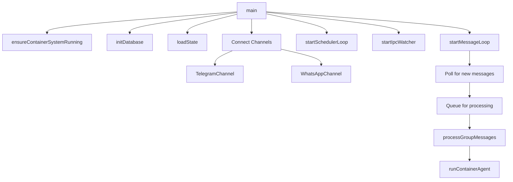
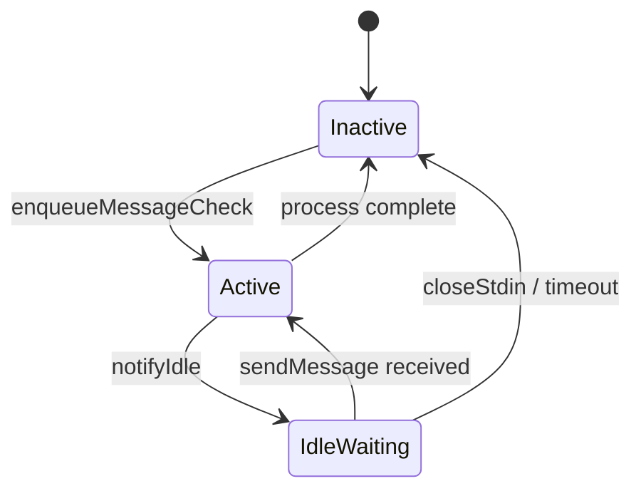
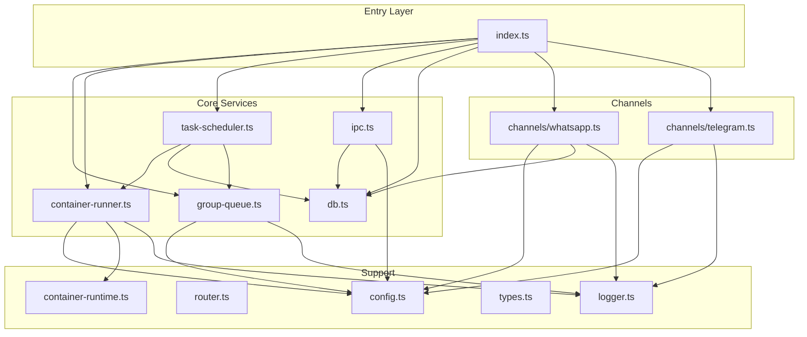
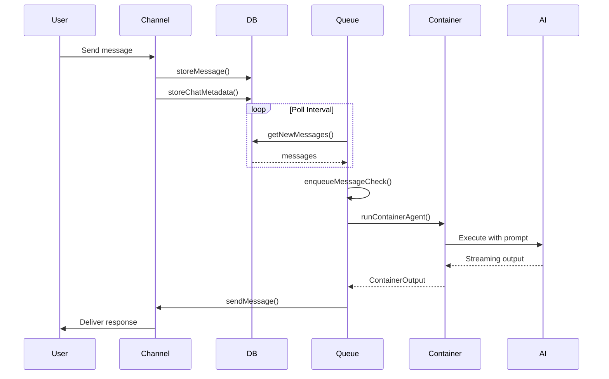
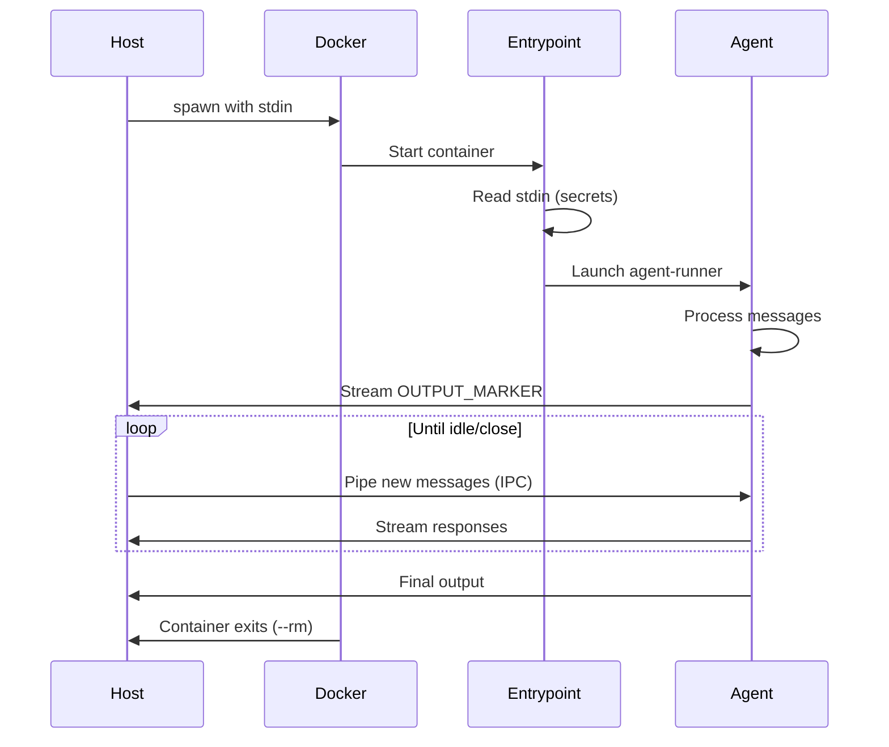
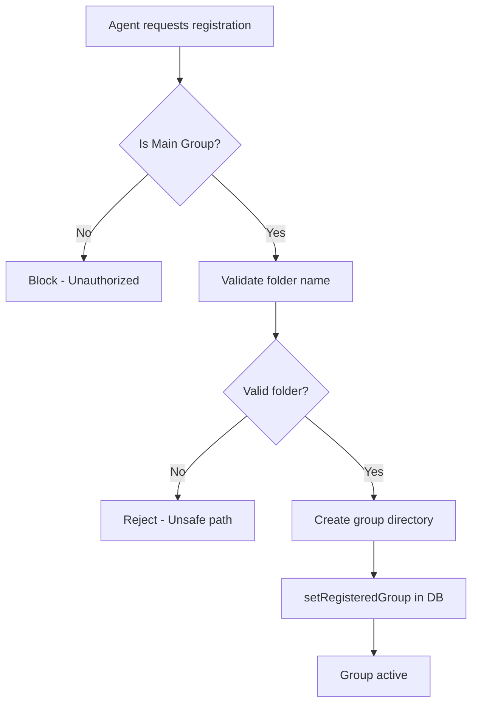

# JimmyClaw Architecture

## Overview

JimmyClaw is a lightweight, secure, and customizable personal Claude assistant that bridges messaging platforms (WhatsApp, Telegram) with containerized AI agent execution. The system enables users to interact with Claude AI from group chats while maintaining security through container isolation.

**Technology Stack:**
- Runtime: Bun (TypeScript)
- Database: SQLite with Drizzle ORM
- Container: Docker
- Messaging: Baileys (WhatsApp), Grammy (Telegram)

**Key Characteristics:**
- Multi-channel support (WhatsApp, Telegram)
- Per-group container isolation
- Streaming output from AI agents
- Scheduled task execution
- IPC-based agent-to-host communication

---

## Implementation Details

### Core Components

#### 1. Entry Point (`src/index.ts`)

The main orchestrator that:
- Initializes database and loads state
- Creates and connects messaging channels
- Starts the message polling loop
- Manages graceful shutdown



#### 2. Channel Abstraction (`src/channels/`)

Implements a unified `Channel` interface for messaging platforms:

```typescript
interface Channel {
  name: string;
  connect(): Promise<void>;
  sendMessage(jid: string, text: string): Promise<void>;
  isConnected(): boolean;
  ownsJid(jid: string): boolean;
  disconnect(): Promise<void>;
  setTyping?(jid: string, isTyping: boolean): Promise<void>;
}
```

| Channel | JID Format | Library |
|---------|------------|---------|
| WhatsApp | `xxx@g.us` (groups), `xxx@s.whatsapp.net` (DMs) | Baileys |
| Telegram | `tg:xxx` | Grammy |

#### 3. Group Queue (`src/group-queue.ts`)

Manages concurrent container execution with:
- **Concurrency limiting** (`MAX_CONCURRENT_CONTAINERS`)
- **Per-group queuing** for messages and tasks
- **Retry with exponential backoff** (max 5 retries)
- **IPC message piping** to active containers



#### 4. Container Runner (`src/container-runner.ts`)

Spawns and manages Docker containers for AI agent execution:

**Volume Mounts:**
| Path | Purpose | Access |
|------|---------|--------|
| `/workspace/project` | Project root (main group only) | Read-only |
| `/workspace/group` | Group-specific folder | Read-write |
| `/workspace/global` | Shared resources | Read-only |
| `/workspace/ipc` | IPC directory | Read-write |
| `/home/node/.claude` | Claude sessions & settings | Read-write |

**Security Features:**
- Secrets passed via stdin (never mounted)
- User namespace mapping (`--user uid:gid`)
- Mount allowlist validation
- Per-group session isolation

**Output Streaming:**
Uses sentinel markers for robust parsing:
```
---JIMMYCLAW_OUTPUT_START---
{...json...}
---JIMMYCLAW_OUTPUT_END---
```

#### 5. Task Scheduler (`src/task-scheduler.ts`)

Handles scheduled task execution:

**Schedule Types:**
- `cron`: Standard cron expressions
- `interval`: Millisecond intervals
- `once`: One-time execution at timestamp

**Context Modes:**
- `group`: Inherits group's session context
- `isolated`: Fresh session per run

#### 6. IPC System (`src/ipc.ts`)

File-based inter-process communication:

**Directory Structure:**
```
data/ipc/
├── {groupFolder}/
│   ├── messages/   # Outbound messages from agent
│   ├── tasks/      # Task management commands
│   └── input/      # Inbound messages to agent
└── errors/         # Failed IPC files
```

**Supported Commands:**
- `schedule_task`: Create scheduled task
- `pause_task` / `resume_task`: Task control
- `cancel_task`: Delete task
- `register_group`: Register new group (main only)
- `refresh_groups`: Sync group metadata (main only)

#### 7. Database Layer (`src/db.ts`)

SQLite with Drizzle ORM, storing:
- Messages and chat metadata
- Registered groups configuration
- Scheduled tasks and run logs
- Session IDs per group
- Router state (timestamps, cursors)

---

## Dependencies

### Internal Module Graph (Depth 3)



### External Dependencies

| Package | Purpose |
|---------|---------|
| `@whiskeysockets/baileys` | WhatsApp Web protocol |
| `grammy` | Telegram Bot API |
| `drizzle-orm` | Type-safe SQL ORM |
| `cron-parser` | Cron expression parsing |
| `pino` / `pino-pretty` | Structured logging |
| `zod` | Runtime validation |
| `yaml` | YAML parsing |
| `qrcode` / `qrcode-terminal` | QR code generation |

---

## Visual Diagrams

### Message Flow



### Container Lifecycle



### Group Registration Flow



---

## Additional Insights

### Security Considerations

1. **Container Isolation**: Each group runs in isolated containers with restricted mounts
2. **Secret Handling**: OAuth tokens and API keys passed via stdin, never persisted in containers
3. **Mount Allowlist**: External directory mounts validated against `~/.config/nanoclaw/mount-allowlist.json`
4. **IPC Authorization**: Commands validated against source group identity
5. **Path Validation**: Group folders validated against path traversal attacks

### Performance Characteristics

| Aspect | Configuration | Default |
|--------|---------------|---------|
| Poll Interval | `POLL_INTERVAL` | 2000ms |
| Container Timeout | `CONTAINER_TIMEOUT` | 30 min |
| Idle Timeout | `IDLE_TIMEOUT` | 30 min |
| Max Concurrent | `MAX_CONCURRENT_CONTAINERS` | 5 |
| Max Output Size | `CONTAINER_MAX_OUTPUT_SIZE` | 10MB |

### Error Handling

- **Container failures**: Retry with exponential backoff (5s, 10s, 20s, 40s, 80s)
- **Message cursor rollback**: On error without output, cursor rewinds for retry
- **Graceful degradation**: Failed channels continue operating; queue persists messages
- **Orphan cleanup**: Stale containers from previous runs cleaned on startup

### Potential Improvements

1. **Webhook support** for real-time message delivery (vs polling)
2. **Horizontal scaling** with shared database
3. **Metrics export** for observability (Prometheus/OpenTelemetry)
4. **Rate limiting** per group/user
5. **Message encryption** at rest

---

## Metadata

| Field | Value |
|-------|-------|
| Analysis Date | 2026-02-26 |
| Depth | 3 (full codebase) |
| Files Analyzed | 15 core modules |
| Lines of Code | ~3,500 |
| Language | TypeScript (Bun) |

---

## Next Steps

1. **Deep Dive**: Container agent-runner implementation (`container/agent-runner/`)
2. **Skills System**: Explore installed skills in `.claude/skills/` and `.agents/skills/`
3. **MCP Integration**: Review Z.ai MCP server configuration in `container-runner.ts`
4. **Testing**: Review test coverage in `*.test.ts` files
5. **Deployment**: Review Dockerfile and container setup in `container/`
