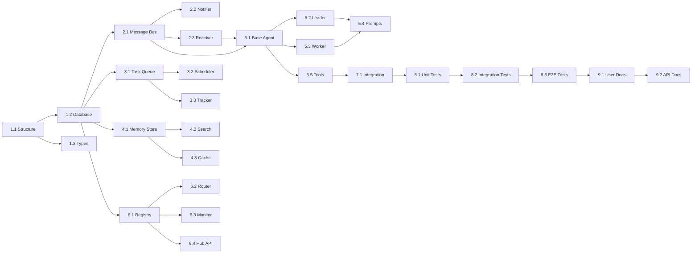

# Planning: Agent Swarm

## Milestones

- [ ] **M1: Foundation** (Day 1) - Database, types, basic structure
- [ ] **M2: Communication** (Day 2) - Message bus, HTTP notifications
- [ ] **M3: Task System** (Day 2-3) - Task queue, assignment, tracking
- [ ] **M4: Shared Memory** (Day 3) - Memory store, search
- [ ] **M5: Agent Runtime** (Day 4-5) - Base agent, leader, worker
- [ ] **M6: Integration** (Day 5) - JimmyClaw integration, tools
- [ ] **M7: Testing** (Day 6) - Unit tests, integration tests
- [ ] **M8: Documentation** (Day 6) - User docs, API docs

---

## Task Breakdown

### Phase 1: Foundation (Day 1)

#### 1.1 Project Structure
- [ ] Create `src/swarm/` directory structure
- [ ] Create `types.ts` with all type definitions
- [ ] Set up barrel exports in `index.ts`
- [ ] Add swarm config to `src/config.ts`

**Effort:** 1 hour
**Dependencies:** None

#### 1.2 Database Schema
- [ ] Create `schema.sql` with all tables
- [ ] Create `migrations/001_initial.sql`
- [ ] Create `db/index.ts` for connection management
- [ ] Add migration runner
- [ ] Integrate with existing `src/db.ts`

**Effort:** 2 hours
**Dependencies:** 1.1

#### 1.3 Core Types
- [ ] Define `SwarmAgent` interface
- [ ] Define `SwarmMessage` interface
- [ ] Define `SwarmTask` interface
- [ ] Define `SwarmMemory` interface
- [ ] Create type guards and validators

**Effort:** 1 hour
**Dependencies:** 1.1

---

### Phase 2: Communication Layer (Day 2)

#### 2.1 Message Bus
- [ ] Create `communication/message-bus.ts`
- [ ] Implement `send(message)` - Save to SQLite
- [ ] Implement `getUnread(agentId)` - Query unread
- [ ] Implement `markRead(messageId, agentId)`
- [ ] Implement `getHistory(channel, limit)`
- [ ] Add message cleanup (7 days TTL)

**Effort:** 3 hours
**Dependencies:** 1.2

#### 2.2 HTTP Notifier
- [ ] Create `communication/notifier.ts`
- [ ] Implement `notify(agentId, message)` - POST to agent
- [ ] Implement `broadcast(message)` - POST to all agents
- [ ] Add retry logic (3 attempts, exponential backoff)
- [ ] Handle offline agents gracefully

**Effort:** 2 hours
**Dependencies:** 2.1

#### 2.3 HTTP Receiver
- [ ] Create `communication/receiver.ts`
- [ ] Create HTTP server for incoming messages
- [ ] Handle `/message` POST endpoint
- [ ] Handle `/health` GET endpoint
- [ ] Add authentication middleware (shared secret)

**Effort:** 2 hours
**Dependencies:** 2.1

---

### Phase 3: Task System (Day 2-3)

#### 3.1 Task Queue
- [ ] Create `tasks/queue.ts`
- [ ] Implement `enqueue(task)` - Add to queue
- [ ] Implement `dequeue(agentId)` - Pull next task
- [ ] Implement `peek()` - View next without pulling
- [ ] Implement `reassign(taskId, newAgentId)`

**Effort:** 2 hours
**Dependencies:** 1.2

#### 3.2 Task Scheduler
- [ ] Create `tasks/scheduler.ts`
- [ ] Implement priority-based ordering
- [ ] Implement dependency resolution
- [ ] Implement deadline checking
- [ ] Add timeout handling

**Effort:** 2 hours
**Dependencies:** 3.1

#### 3.3 Task Tracker
- [ ] Create `tasks/tracker.ts`
- [ ] Implement `updateStatus(taskId, status)`
- [ ] Implement `getTask(taskId)`
- [ ] Implement `listTasks(filter)`
- [ ] Implement `getAgentTasks(agentId)`

**Effort:** 1 hour
**Dependencies:** 3.1

---

### Phase 4: Shared Memory (Day 3)

#### 4.1 Memory Store
- [ ] Create `memory/store.ts`
- [ ] Implement `set(key, value, metadata)`
- [ ] Implement `get(key)`
- [ ] Implement `delete(key)`
- [ ] Implement `list(prefix?)`
- [ ] Add TTL support

**Effort:** 2 hours
**Dependencies:** 1.2

#### 4.2 Memory Search
- [ ] Create `memory/search.ts`
- [ ] Implement `findByTags(tags[])`
- [ ] Implement `findByType(type)`
- [ ] Implement `fullTextSearch(query)`
- [ ] Add search index

**Effort:** 1 hour
**Dependencies:** 4.1

#### 4.3 Memory Cache
- [ ] Create `memory/cache.ts`
- [ ] Implement in-memory LRU cache
- [ ] Add cache invalidation
- [ ] Add cache statistics

**Effort:** 1 hour
**Dependencies:** 4.1

---

### Phase 5: Agent Runtime (Day 4-5)

#### 5.1 Base Agent
- [ ] Create `agent/base.ts`
- [ ] Implement `Agent` abstract class
- [ ] Implement `start()` - Start HTTP server
- [ ] Implement `stop()` - Graceful shutdown
- [ ] Implement `heartbeat()` - Periodic ping
- [ ] Implement `processMessage(message)`
- [ ] Add logging and error handling

**Effort:** 3 hours
**Dependencies:** 2.1, 2.2, 2.3

#### 5.2 Leader Agent (Andy)
- [ ] Create `agent/leader.ts`
- [ ] Extend `Agent` class
- [ ] Implement delegation logic
- [ ] Implement task coordination
- [ ] Implement result synthesis
- [ ] Add leader-specific tools

**Effort:** 4 hours
**Dependencies:** 5.1

#### 5.3 Worker Agent
- [ ] Create `agent/worker.ts`
- [ ] Extend `Agent` class
- [ ] Implement task pulling
- [ ] Implement OpenCode integration
- [ ] Implement result posting
- [ ] Add worker-specific tools

**Effort:** 3 hours
**Dependencies:** 5.1

#### 5.4 Agent Prompts
- [ ] Create `agent/prompts/leader.md`
- [ ] Create `agent/prompts/researcher.md`
- [ ] Create `agent/prompts/coder.md`
- [ ] Create `agent/prompts/reviewer.md`
- [ ] Add prompt loader

**Effort:** 2 hours
**Dependencies:** 5.2, 5.3

#### 5.5 Agent Tools
- [ ] Create `agent/tools.ts`
- [ ] Implement `swarm_send_message` tool
- [ ] Implement `swarm_get_messages` tool
- [ ] Implement `swarm_assign_task` tool
- [ ] Implement `swarm_check_task` tool
- [ ] Implement `swarm_list_tasks` tool
- [ ] Implement `swarm_set_memory` tool
- [ ] Implement `swarm_get_memory` tool
- [ ] Implement `swarm_list_agents` tool
- [ ] Register tools with container-runner

**Effort:** 4 hours
**Dependencies:** 5.1

---

### Phase 6: Agent Hub (Day 5)

#### 6.1 Hub Registry
- [ ] Create `hub/registry.ts`
- [ ] Implement `register(agent)`
- [ ] Implement `unregister(agentId)`
- [ ] Implement `getAgent(agentId)`
- [ ] Implement `listAgents()`

**Effort:** 1 hour
**Dependencies:** 1.2

#### 6.2 Hub Router
- [ ] Create `hub/router.ts`
- [ ] Implement message routing logic
- [ ] Implement broadcast routing
- [ ] Add message logging

**Effort:** 1 hour
**Dependencies:** 6.1, 2.1

#### 6.3 Hub Monitor
- [ ] Create `hub/monitor.ts`
- [ ] Implement health check loop
- [ ] Implement offline detection
- [ ] Implement auto-restart (optional)
- [ ] Add alerts

**Effort:** 2 hours
**Dependencies:** 6.1

#### 6.4 Hub API
- [ ] Create `hub/api.ts`
- [ ] Create HTTP server (port 4000)
- [ ] Implement `/agents` endpoint
- [ ] Implement `/messages` endpoint
- [ ] Implement `/tasks` endpoint
- [ ] Add CORS support

**Effort:** 2 hours
**Dependencies:** 6.1, 6.2, 6.3

---

### Phase 7: Integration (Day 5)

#### 7.1 JimmyClaw Integration
- [ ] Update `src/index.ts` for swarm mode
- [ ] Update `src/db.ts` for swarm tables
- [ ] Update `src/container-runner.ts` for swarm tools
- [ ] Add swarm config to `groups/{name}/`
- [ ] Create startup scripts

**Effort:** 3 hours
**Dependencies:** 5.5, 6.4

#### 7.2 Environment Configuration
- [ ] Create `.env.swarm.example`
- [ ] Update `env.ts` for swarm vars
- [ ] Create `docker-compose.swarm.yml` (optional)
- [ ] Create `scripts/start-swarm.sh`

**Effort:** 1 hour
**Dependencies:** 7.1

---

### Phase 8: Testing (Day 6)

#### 8.1 Unit Tests
- [ ] Test message bus operations
- [ ] Test task queue operations
- [ ] Test memory store operations
- [ ] Test agent base class
- [ ] Test tools

**Effort:** 3 hours
**Dependencies:** All phases

#### 8.2 Integration Tests
- [ ] Test 2-agent communication
- [ ] Test task delegation
- [ ] Test shared memory
- [ ] Test leader-worker flow
- [ ] Test error scenarios

**Effort:** 3 hours
**Dependencies:** 8.1

#### 8.3 E2E Tests
- [ ] Test full swarm startup
- [ ] Test user request → team response
- [ ] Test agent crash recovery
- [ ] Test concurrent tasks

**Effort:** 2 hours
**Dependencies:** 8.2

---

### Phase 9: Documentation (Day 6)

#### 9.1 User Documentation
- [ ] Create `docs/swarm/README.md`
- [ ] Create `docs/swarm/quickstart.md`
- [ ] Create `docs/swarm/configuration.md`
- [ ] Create `docs/swarm/agent-roles.md`

**Effort:** 2 hours
**Dependencies:** All phases

#### 9.2 API Documentation
- [ ] Document all swarm tools
- [ ] Document HTTP endpoints
- [ ] Document environment variables
- [ ] Add examples

**Effort:** 1 hour
**Dependencies:** 9.1

---

## Dependencies



### Critical Path

```
1.1 → 1.2 → 2.1 → 5.1 → 5.5 → 7.1 → 8.1 → 8.2 → 8.3
```

### Parallel Work Opportunities

| Parallel Track | Tasks |
|----------------|-------|
| Track 1 | Communication (2.1, 2.2, 2.3) |
| Track 2 | Tasks (3.1, 3.2, 3.3) |
| Track 3 | Memory (4.1, 4.2, 4.3) |

---

## Timeline & Estimates

### Effort Summary

| Phase | Tasks | Effort |
|-------|-------|--------|
| 1. Foundation | 3 | 4 hours |
| 2. Communication | 3 | 7 hours |
| 3. Task System | 3 | 5 hours |
| 4. Shared Memory | 3 | 4 hours |
| 5. Agent Runtime | 5 | 16 hours |
| 6. Agent Hub | 4 | 6 hours |
| 7. Integration | 2 | 4 hours |
| 8. Testing | 3 | 8 hours |
| 9. Documentation | 2 | 3 hours |
| **Total** | **28** | **57 hours** |

### Timeline (6 Days)

| Day | Focus | Tasks | Hours |
|-----|-------|-------|-------|
| **Day 1** | Foundation | 1.1, 1.2, 1.3 | 4h |
| **Day 2** | Communication + Tasks | 2.1, 2.2, 2.3, 3.1 | 9h |
| **Day 3** | Tasks + Memory | 3.2, 3.3, 4.1, 4.2, 4.3 | 7h |
| **Day 4** | Agent Runtime | 5.1, 5.2, 5.3 | 10h |
| **Day 5** | Agents + Hub + Integration | 5.4, 5.5, 6.1-6.4, 7.1 | 12h |
| **Day 6** | Testing + Docs | 8.1-8.3, 9.1-9.2 | 9h |

---

## Risks & Mitigation

### Technical Risks

| Risk | Impact | Probability | Mitigation |
|------|--------|-------------|------------|
| SQLite performance with many messages | Medium | Low | Add indexes, implement cleanup |
| OpenCode CLI subprocess issues | High | Medium | Add robust error handling, HTTP fallback |
| Agent deadlock (circular delegation) | Medium | Medium | Add cycle detection, timeout |
| Memory conflicts | Low | Medium | Last-write-wins with timestamps |
| HTTP notification failures | Medium | High | Retry logic, polling fallback |

### Integration Risks

| Risk | Impact | Probability | Mitigation |
|------|--------|-------------|------------|
| Breaking existing JimmyClaw | High | Low | Feature flag, separate code path |
| Container isolation conflicts | Medium | Medium | Test thoroughly, document requirements |
| Environment variable conflicts | Low | Low | Use SWARM_ prefix |

### Resource Risks

| Risk | Impact | Probability | Mitigation |
|------|--------|-------------|------------|
| VPS memory exhaustion | High | Medium | Limit agents to 4, add memory limits |
| Disk space (SQLite) | Low | Low | Implement cleanup, monitor size |
| Network ports conflict | Low | Low | Use configurable ports |

---

## Resources Needed

### Development

| Resource | Purpose |
|----------|---------|
| Claude API key | For leader agent (Andy) |
| Gemini API key | For researcher (Sarah) via OpenCode |
| Groq API key | For coder (Mike) via OpenCode |
| OpenCode CLI | Free model access |
| VPS (2GB RAM) | Development testing |

### Tools

| Tool | Purpose |
|------|---------|
| Bun | TypeScript runtime |
| SQLite | Database |
| curl / httpie | HTTP testing |
| pm2 | Process management |

### Knowledge

| Topic | Resources |
|-------|-----------|
| OpenCode CLI | https://opencode.ai/docs/cli/ |
| SQLite FTS5 | https://www.sqlite.org/fts5.html |
| Agent coordination patterns | GoClaw internal/agent/ |
| Process management | pm2 docs |

---

## Implementation Order (Recommended)

### Week 1: Core Infrastructure

```
Day 1: Foundation
├── 1.1 Create structure
├── 1.2 Database schema
└── 1.3 Core types

Day 2: Communication
├── 2.1 Message bus
├── 2.2 HTTP notifier
└── 2.3 HTTP receiver

Day 3: Tasks + Memory
├── 3.1 Task queue
├── 3.2 Scheduler
├── 4.1 Memory store
└── 4.2 Search
```

### Week 1: Agent System

```
Day 4: Agent Runtime
├── 5.1 Base agent
├── 5.2 Leader agent
└── 5.3 Worker agent

Day 5: Complete Agents + Integration
├── 5.4 Prompts
├── 5.5 Tools
├── 6.1-6.4 Hub
└── 7.1 Integration

Day 6: Testing + Docs
├── 8.1-8.3 Testing
└── 9.1-9.2 Documentation
```

---

## Success Metrics

### Technical Metrics

| Metric | Target |
|--------|--------|
| Test coverage | >80% |
| Message delivery time | <100ms |
| Task assignment time | <50ms |
| Agent startup time | <5s |
| Memory usage per agent | <200MB |

### Functional Metrics

| Metric | Target |
|--------|--------|
| Parallel tasks | 4+ |
| Agent uptime | >99% |
| Message delivery rate | >99.9% |
| Task completion rate | >95% |

---

## Rollout Plan

### Phase 1: Internal Testing (Day 1-4)
- Developer testing only
- Single machine
- Debug logging enabled

### Phase 2: Alpha (Day 5)
- Limited deployment
- 2 agents (Andy + Sarah)
- Monitor for issues

### Phase 3: Beta (Day 6+)
- Full 4-agent deployment
- Documentation complete
- User testing

### Phase 4: Production
- Feature flag for gradual rollout
- Monitoring dashboards
- Incident response plan
