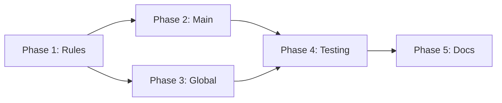

# Project Planning & Task Breakdown

## Milestones
**What are the major checkpoints?**

- [x] Milestone 1: Rules drafted
- [x] Milestone 2: CLAUDE.md updated (main)
- [x] Milestone 3: CLAUDE.md updated (global)
- [ ] Milestone 4: Testing with various queries
- [ ] Milestone 5: Documentation complete

## Task Breakdown
**What specific work needs to be done?**

### Phase 1: Rule Definition
- [x] Task 1.1: Draft verification rules ✅ 2026-02-27
- [x] Task 1.2: Draft citation format ✅ 2026-02-27
- [x] Task 1.3: Draft confidence levels ✅ 2026-02-27
- [x] Task 1.4: Draft prohibited behaviors list ✅ 2026-02-27
- [x] Task 1.5: Review rules for clarity ✅ 2026-02-27

### Phase 2: Main CLAUDE.md Update
- [x] Task 2.1: Add Anti-Hallucination Rules section ✅ 2026-02-27
- [x] Task 2.2: Add Citation Format section ✅ 2026-02-27
- [x] Task 2.3: Add Confidence Levels section ✅ 2026-02-27
- [x] Task 2.4: Add Response Protocol section ✅ 2026-02-27 (merged into main section)
- [x] Task 2.5: Add examples ✅ 2026-02-27

### Phase 3: Global CLAUDE.md Update
- [x] Task 3.1: Copy rules to global/CLAUDE.md ✅ 2026-02-27
- [x] Task 3.2: Adjust for non-main groups ✅ 2026-02-27 (simplified version without MEMORY.md refs)
- [x] Task 3.3: Ensure consistency ✅ 2026-02-27

### Phase 4: Testing
- [ ] Task 4.1: Test with factual questions (known info)
- [ ] Task 4.2: Test with factual questions (unknown info)
- [ ] Task 4.3: Test with speculative questions
- [ ] Task 4.4: Verify citation format
- [ ] Task 4.5: Test with older/smaller models

### Phase 5: Documentation
- [x] Task 5.1: Document in README ✅ 2026-02-27
- [x] Task 5.2: Add examples to CLAUDE.md ✅ 2026-02-27 (done in Phase 2)
- [x] Task 5.3: Create troubleshooting guide ✅ 2026-02-27 (docs/ai/troubleshooting/anti-hallucination.md)

## Dependencies
**What needs to happen in what order?**

- Phase 1 must complete first (defines content)
- Phase 2-3 can run in parallel
- Phase 4 tests both
- Phase 5 documents results

## Timeline & Estimates
**When will things be done?**

| Phase | Effort | Duration |
|-------|--------|----------|
| Phase 1: Rules | 1 hour | Day 1 |
| Phase 2: Main | 30 min | Day 1 |
| Phase 3: Global | 15 min | Day 1 |
| Phase 4: Testing | 1.5 hours | Day 1-2 |
| Phase 5: Docs | 30 min | Day 2 |
| **Total** | **3.75 hours** | **2 days** |

## Risks & Mitigation
**What could go wrong?**

| Risk | Likelihood | Impact | Mitigation |
|------|------------|--------|------------|
| Rules ignored by model | Medium | High | Strengthen language, add examples |
| Over-cautious responses | Medium | Medium | Tune confidence thresholds |
| Citation format inconsistent | Medium | Low | Add more examples |
| Breaks existing behavior | Low | Medium | Test thoroughly |

## Resources Needed
**What do we need to succeed?**

- Access to CLAUDE.md files
- Test queries (factual, unknown, speculative)
- Multiple model access for testing
- Time for iteration

## Success Metrics
- [ ] All factual responses include citation
- [ ] "I don't know" used for unknown information
- [ ] No invented phone numbers/emails/dates
- [ ] Works with Haiku, Sonnet, and Opus
