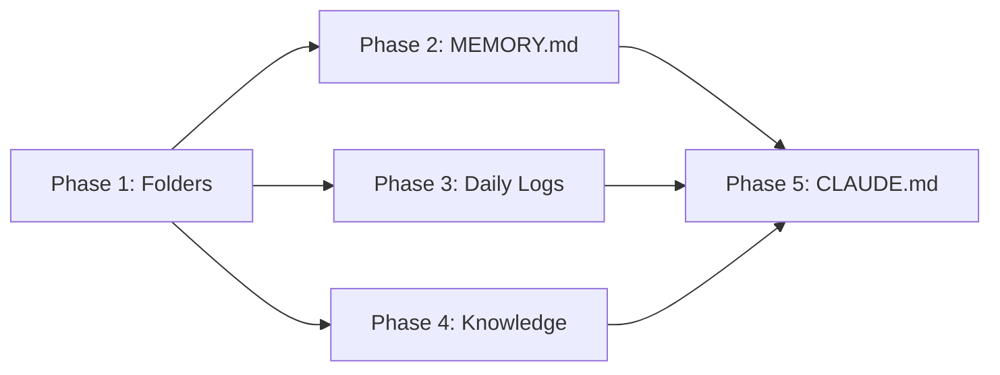

# Project Planning & Task Breakdown

## Milestones
**What are the major checkpoints?**

- [x] Milestone 1: Basic folder structure created ✅ 2026-02-27
- [x] Milestone 2: MEMORY.md template in place ✅ 2026-02-27
- [x] Milestone 3: Daily log system working ✅ 2026-02-27
- [x] Milestone 4: Knowledge folder populated ✅ 2026-02-27
- [x] Milestone 5: Agent reads memory at session start ✅ 2026-02-27 (documented in CLAUDE.md)

## Task Breakdown
**What specific work needs to be done?**

### Phase 1: Folder Structure
- [x] Task 1.1: Create `groups/main/memory/` directory ✅ 2026-02-27
- [x] Task 1.2: Create `groups/main/knowledge/` directory ✅ 2026-02-27
- [x] Task 1.3: Create `.gitkeep` files for empty directories ✅ 2026-02-27
- [x] Task 1.4: Update `.gitignore` if needed ✅ 2026-02-27

### Phase 2: MEMORY.md Template
- [x] Task 2.1: Create `groups/main/MEMORY.md` with template sections ✅ 2026-02-27
- [x] Task 2.2: Add Preferences section ✅ 2026-02-27
- [x] Task 2.3: Add Contacts section ✅ 2026-02-27
- [x] Task 2.4: Add Projects section ✅ 2026-02-27
- [x] Task 2.5: Add Key Decisions section ✅ 2026-02-27

### Phase 3: Daily Log System
- [x] Task 3.1: Create initial daily log file (`memory/YYYY-MM-DD.md`) ✅ 2026-02-27
- [x] Task 3.2: Document daily log format in CLAUDE.md ✅ 2026-02-27
- [ ] Task 3.3: Test agent writing to daily log

### Phase 4: Knowledge Structure
- [x] Task 4.1: Create `knowledge/customers.md` template ✅ 2026-02-27
- [x] Task 4.2: Create `knowledge/preferences.md` template ✅ 2026-02-27
- [x] Task 4.3: Create `knowledge/projects/` subfolder structure ✅ 2026-02-27

### Phase 5: CLAUDE.md Updates
- [x] Task 5.1: Add memory section to `groups/main/CLAUDE.md` ✅ 2026-02-27
- [x] Task 5.2: Document memory loading protocol ✅ 2026-02-27
- [x] Task 5.3: Document memory writing protocol ✅ 2026-02-27
- [x] Task 5.4: Add examples of memory usage ✅ 2026-02-27

## Dependencies
**What needs to happen in what order?**

- Phase 1 must complete first (creates directories)
- Phases 2-4 can run in parallel
- Phase 5 depends on 2-4 (documents what was created)

## Timeline & Estimates
**When will things be done?**

| Phase | Effort | Duration |
|-------|--------|----------|
| Phase 1: Folders | 15 min | Day 1 |
| Phase 2: MEMORY.md | 30 min | Day 1 |
| Phase 3: Daily Logs | 30 min | Day 1 |
| Phase 4: Knowledge | 30 min | Day 1 |
| Phase 5: CLAUDE.md | 30 min | Day 1 |
| **Total** | **2.25 hours** | **1 day** |

## Risks & Mitigation
**What could go wrong?**

| Risk | Likelihood | Impact | Mitigation |
|------|------------|--------|------------|
| Agent doesn't auto-read memory | Medium | High | Update CLAUDE.md with explicit read instructions |
| Memory files grow too large | Low | Medium | Document size limits, splitting strategy |
| Conflicting information | Medium | Low | Document conflict resolution in CLAUDE.md |
| Files not mounted in container | Low | High | Verify mount configuration |

## Resources Needed
**What do we need to succeed?**

- Access to `groups/main/` directory
- Understanding of current container mount configuration
- Ability to test with actual agent sessions
