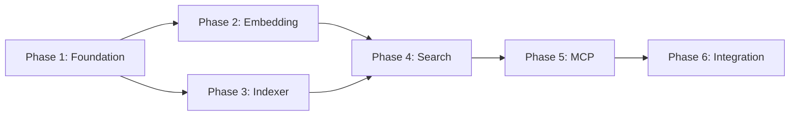

# Project Planning & Task Breakdown

## Milestones
**What are the major checkpoints?**

- [x] Milestone 1: SQLite schema designed ✅ 2026-02-27
- [x] Milestone 2: Embedding client working ✅ 2026-02-27 (OpenRouter API)
- [x] Milestone 3: Indexer implemented ✅ 2026-02-27
- [x] Milestone 4: Hybrid search working ✅ 2026-02-27
- [x] Milestone 5: MCP server deployed ✅ 2026-02-27
- [ ] Milestone 6: Integration testing complete

## Task Breakdown
**What specific work needs to be done?**

### Phase 1: Foundation
- [x] Task 1.1: Create `container/rag-server/` directory structure ✅ 2026-02-27
- [x] Task 1.2: Initialize package.json with dependencies ✅ 2026-02-27
- [x] Task 1.3: Design SQLite schema (documents, FTS5) ✅ 2026-02-27
- [x] Task 1.4: Create database initialization script ✅ 2026-02-27

### Phase 2: Embedding Client
- [x] Task 2.1: Implement OpenRouter embedding client ✅ 2026-02-27
- [x] Task 2.2: Add embedding cache (LRU) ✅ 2026-02-27
- [x] Task 2.3: Implement query normalization ✅ 2026-02-27 (hash-based caching)
- [x] Task 2.4: Add error handling and retries ✅ 2026-02-27

### Phase 3: File Indexer
- [x] Task 3.1: Implement file walker for memory files ✅ 2026-02-27
- [x] Task 3.2: Implement Markdown chunker (~400 tokens) ✅ 2026-02-27
- [x] Task 3.3: Implement incremental indexing ✅ 2026-02-27 (hash-based)
- [x] Task 3.4: Add debouncing for rapid changes ✅ 2026-02-27

### Phase 4: Search Engine
- [x] Task 4.1: Implement BM25 search (FTS5) ✅ 2026-02-27
- [x] Task 4.2: Implement vector search (cosine similarity) ✅ 2026-02-27
- [x] Task 4.3: Implement hybrid merge algorithm ✅ 2026-02-27
- [x] Task 4.4: Add result ranking and scoring ✅ 2026-02-27

### Phase 5: MCP Server
- [x] Task 5.1: Create MCP server scaffold ✅ 2026-02-27
- [x] Task 5.2: Implement `memory_search` tool ✅ 2026-02-27
- [x] Task 5.3: Implement `memory_get` tool ✅ 2026-02-27
- [x] Task 5.4: Add to container configuration ✅ 2026-02-27

### Phase 6: Integration
- [x] Task 6.1: Update container-runner to include RAG server ✅ 2026-02-27
- [x] Task 6.2: Add to allowed tools in agent-runner ✅ 2026-02-27
- [ ] Task 6.3: Test with actual queries
- [ ] Task 6.4: Performance optimization

## Dependencies
**What needs to happen in what order?**

- Phase 1 must complete first (database)
- Phase 2-3 can run in parallel
- Phase 4 depends on 2-3
- Phase 5-6 sequential

## Timeline & Estimates
**When will things be done?**

| Phase | Effort | Duration |
|-------|--------|----------|
| Phase 1: Foundation | 3 hours | Day 1-2 |
| Phase 2: Embedding | 2 hours | Day 2 |
| Phase 3: Indexer | 4 hours | Day 2-3 |
| Phase 4: Search | 4 hours | Day 3-4 |
| Phase 5: MCP | 3 hours | Day 4-5 |
| Phase 6: Integration | 2 hours | Day 5 |
| **Total** | **18 hours** | **5 days** |

## Risks & Mitigation
**What could go wrong?**

| Risk | Likelihood | Impact | Mitigation |
|------|------------|--------|------------|
| sqlite-vec not available on platform | Medium | High | Fallback to in-memory vectors |
| OpenAI API rate limits | Medium | Medium | Add caching, rate limiting |
| Search latency too high | Medium | Medium | Optimize queries, add caching |
| Index size grows too large | Low | Medium | Add cleanup for old docs |

## Resources Needed
**What do we need to succeed?**

- OpenRouter API key for embeddings (or Z_AI_API_KEY)
- SQLite with FTS5 support (bun:sqlite)
- Test data for indexing

## Open Questions - RESOLVED
- [x] ~~Local embedding model alternative?~~ → OpenRouter API with fallback to dummy embeddings
- [x] ~~Index storage location (per-group vs shared)?~~ → Per-group: `data/rag/{groupFolder}.sqlite`
- [x] ~~Reindex trigger (manual, cron, watch)?~~ → Manual via `memory_reindex` tool + optional `reindex` param in search
