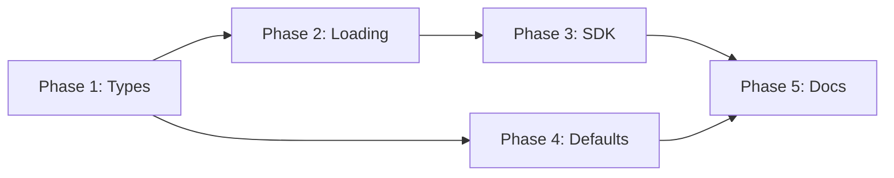

# Project Planning & Task Breakdown

## Milestones
**What are the major checkpoints?**

- [x] Milestone 1: Config schema defined ✅ 2026-02-27
- [x] Milestone 2: Config loading implemented ✅ 2026-02-27
- [x] Milestone 3: SDK integration working ✅ 2026-02-27
- [x] Milestone 4: Default config created ✅ 2026-02-27
- [ ] Milestone 5: Testing with different models

## Task Breakdown
**What specific work needs to be done?**

### Phase 1: Schema & Types
- [x] Task 1.1: Define TypeScript interfaces for AgentConfig ✅ 2026-02-27
- [x] Task 1.2: Define TypeScript interfaces for SubAgentConfig ✅ 2026-02-27
- [x] Task 1.3: Create type file in `container/agent-runner/src/types.ts` ✅ 2026-02-27

### Phase 2: Config Loading
- [x] Task 2.1: Implement `loadAgentConfig()` function ✅ 2026-02-27
- [x] Task 2.2: Implement `getDefaultConfig()` function ✅ 2026-02-27
- [x] Task 2.3: Add config validation with helpful errors ✅ 2026-02-27
- [x] Task 2.4: Add logging for config loading ✅ 2026-02-27

### Phase 3: SDK Integration
- [x] Task 3.1: Implement `buildAgentsOption()` function ✅ 2026-02-27
- [x] Task 3.2: Map model names to Claude model IDs ✅ 2026-02-27
- [x] Task 3.3: Integrate with existing `query()` call ✅ 2026-02-27
- [x] Task 3.4: Handle `inherit` model option ✅ 2026-02-27

### Phase 4: Default Configuration
- [x] Task 4.1: Create `groups/main/agent-config.json` ✅ 2026-02-27
- [x] Task 4.2: Define default researcher agent ✅ 2026-02-27
- [x] Task 4.3: Define default coder agent ✅ 2026-02-27
- [x] Task 4.4: Define default reviewer agent ✅ 2026-02-27

### Phase 5: Documentation
- [x] Task 5.1: Update `groups/main/CLAUDE.md` with config docs ✅ 2026-02-27
- [x] Task 5.2: Add example configurations ✅ 2026-02-27
- [x] Task 5.3: Document available models ✅ 2026-02-27
- [x] Task 5.4: Document agent types ✅ 2026-02-27

## Dependencies
**What needs to happen in what order?**

- Phase 1 must complete first (defines types)
- Phase 2-4 can partially overlap
- Phase 5 last (documents everything)

## Timeline & Estimates
**When will things be done?**

| Phase | Effort | Duration |
|-------|--------|----------|
| Phase 1: Types | 30 min | Day 1 |
| Phase 2: Loading | 1 hour | Day 1 |
| Phase 3: SDK | 1.5 hours | Day 1-2 |
| Phase 4: Defaults | 30 min | Day 2 |
| Phase 5: Docs | 30 min | Day 2 |
| **Total** | **4 hours** | **2 days** |

## Risks & Mitigation
**What could go wrong?**

| Risk | Likelihood | Impact | Mitigation |
|------|------------|--------|------------|
| SDK doesn't support `agents` option | Low | High | Verify SDK version, check docs |
| Model names change | Medium | Medium | Use config mapping layer |
| Invalid config breaks agent | Medium | High | Validate config, fallback to defaults |
| Sub-agents don't use specified model | Medium | High | Add logging to verify model selection |

## Resources Needed
**What do we need to succeed?**

- Claude Agent SDK documentation
- Access to container/agent-runner code
- Test environment with different models
- API access for testing

## Open Questions
- [ ] What's the minimum SDK version required?
- [ ] Should we support custom prompts per agent?
- [ ] How to expose model usage in logs?
